# IODD Manager - System Architecture

**Version 2.0** | **Production Release** | **November 2025**

---

## Overview

GreenStack (formerly IODD Manager) is a comprehensive intelligent device management platform for importing, managing, and analyzing IO-Link Device Description (IODD) and EtherNet/IP (EDS) device configurations. The system provides a REST API backend, modern React frontend with advanced UX features, and complete database storage for device data.

**Core Capabilities:**
- Import and parse IODD XML files and EDS device descriptions
- Multi-file and nested ZIP import
- Interactive device configuration interface
- RESTful API for device management
- Web-based dashboard with analytics and visualization
- Dark/light theme with system preference detection
- Comprehensive keyboard shortcuts for power users
- Rich data analytics with interactive charts

---

## System Architecture

### High-Level Architecture

```mermaid
graph TB
    subgraph "Client Layer"
        Browser[Web Browser]
        API_Client[API Client/CLI]
    end

    subgraph "Application Layer"
        Frontend[React Frontend<br/>Port 5173]
        API[FastAPI Backend<br/>Port 8000]
    end

    subgraph "Business Logic"
        Parser[IODD Parser]
        Manager[Device Manager]
        Assets[Asset Handler]
        Menus[Menu System]
    end

    subgraph "Data Layer"
        DB[(SQLite/PostgreSQL<br/>Database)]
        Storage[File Storage<br/>iodd_storage/]
    end

    Browser --> Frontend
    API_Client --> API
    Frontend --> API
    API --> Parser
    API --> Manager
    API --> Assets
    API --> Menus
    Parser --> DB
    Manager --> DB
    Assets --> Storage
    Menus --> DB

    style Frontend fill:#61dafb
    style API fill:#009688
    style DB fill:#003545
    style Storage fill:#ffa500
```

---

## Component Architecture

### Application Layers

```mermaid
graph LR
    subgraph "Presentation"
        A[React Components]
        B[UI Library<br/>shadcn/ui]
        C[State Management]
    end

    subgraph "API"
        D[FastAPI Routes]
        E[Request Validation]
        F[Error Handling]
    end

    subgraph "Business Logic"
        G[IODD Parser]
        H[Device Management]
        I[Asset Processing]
    end

    subgraph "Data Access"
        J[Database ORM]
        K[File System]
        L[Cache Layer]
    end

    A --> D
    B --> D
    C --> D
    D --> G
    E --> G
    F --> G
    G --> J
    H --> J
    I --> K

    style A fill:#61dafb
    style D fill:#009688
    style G fill:#ffa500
    style J fill:#003545
```

---

## Technology Stack

### Backend Stack

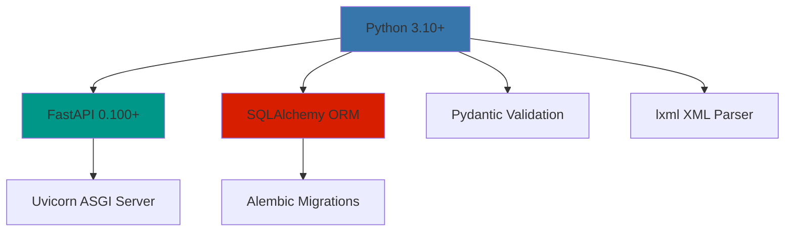

### Frontend Stack

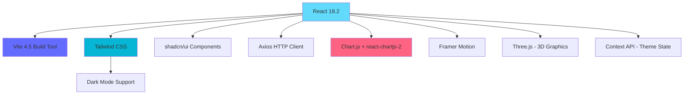

---

## Data Flow

### IODD Import Workflow

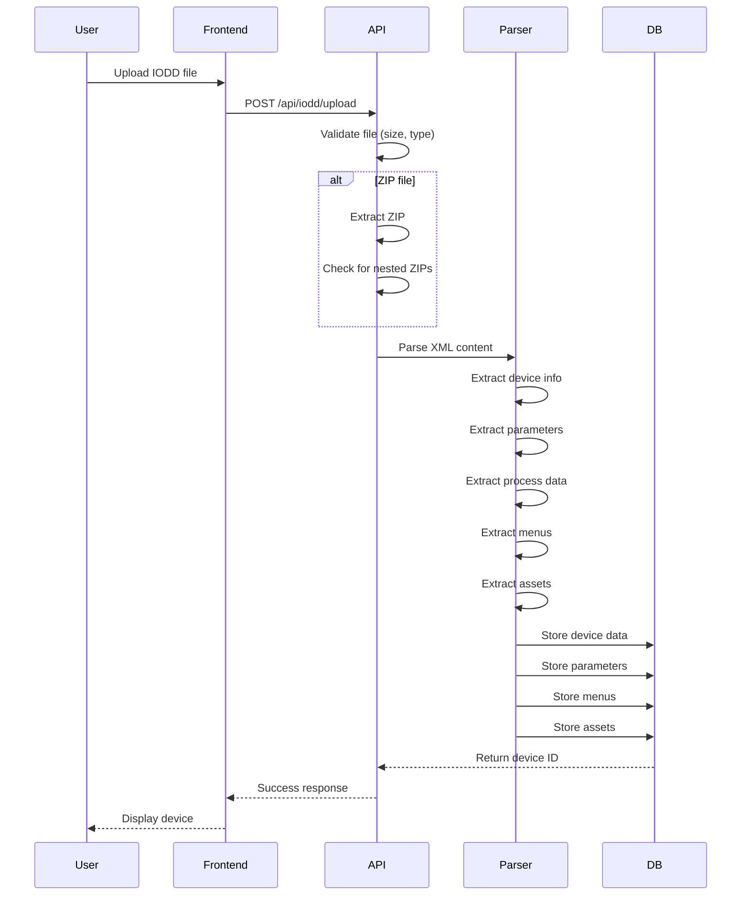

### Device Details Request

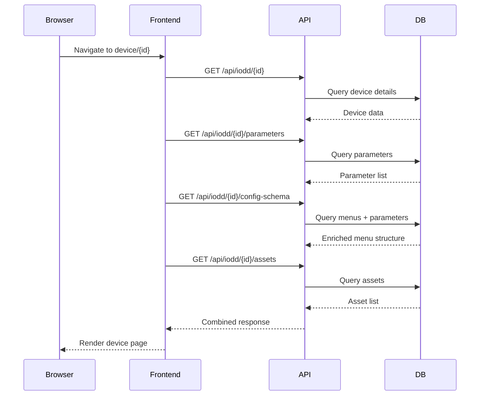

---

## Database Schema

### Entity Relationship Diagram

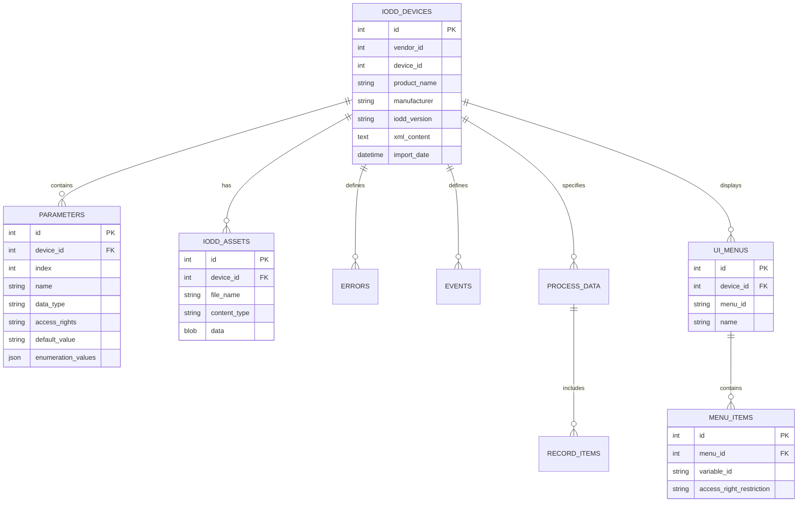

---

## Core Components

### 1. IODD Parser (iodd_manager.py)

**Responsibilities:**
- Parse IODD XML files using lxml
- Extract device identification information
- Parse all parameter definitions (Variable and StdVariableRef)
- Extract process data structures
- Parse UI menu definitions
- Extract embedded assets (images, documents)

**Key Methods:**
```python
class IODDParser:
    def parse() -> DeviceProfile
    def _extract_vendor_info() -> VendorInfo
    def _extract_device_info() -> DeviceInfo
    def _extract_parameters() -> List[Parameter]
    def _parse_std_variable_ref() -> Optional[Parameter]
    def _extract_process_data() -> ProcessDataCollection
    def _extract_ui_menus() -> UserInterfaceMenus
    def _extract_assets() -> List[Asset]
```

**Standard IO-Link Variables:**
The parser handles 19+ standard IO-Link variables defined by the IO-Link specification:
- Device identification (V_VendorName, V_ProductName, V_SerialNumber)
- Version information (V_HardwareRevision, V_FirmwareRevision)
- Tag variables (V_ApplicationSpecificTag, V_FunctionSpecificTag)
- Status variables (V_DeviceStatus, V_DetailedDeviceStatus)

---

### 2. REST API (api.py)

**Endpoints:**

```
Device Management:
  GET    /api/iodd              # List all devices
  GET    /api/iodd/{id}         # Get device details
  POST   /api/iodd/upload       # Import IODD file
  DELETE /api/iodd/{id}         # Delete device
  POST   /api/iodd/bulk-delete  # Delete multiple
  POST   /api/iodd/reset        # Reset database

Device Data:
  GET /api/iodd/{id}/parameters      # Device parameters
  GET /api/iodd/{id}/errors          # Error definitions
  GET /api/iodd/{id}/events          # Event definitions
  GET /api/iodd/{id}/processdata     # Process data
  GET /api/iodd/{id}/menus           # UI menu structure
  GET /api/iodd/{id}/config-schema   # Enriched config schema
  GET /api/iodd/{id}/assets          # Device assets
  GET /api/iodd/{id}/xml             # Raw XML source

System:
  GET /api/health                    # Health check
  GET /api/stats                     # System statistics
```

---

### 3. User Experience Features

GreenStack includes advanced user experience features built with modern web technologies.

#### Theme System

**Architecture:**
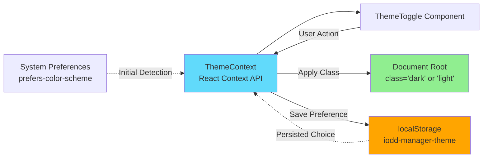

**Features:**
- System preference detection via `prefers-color-scheme` media query
- localStorage persistence across sessions
- Manual override with animated toggle button
- Instant theme switching without page reload
- Tailwind CSS class-based dark mode (`dark:` prefix)

#### Keyboard Shortcuts System

**Architecture:**
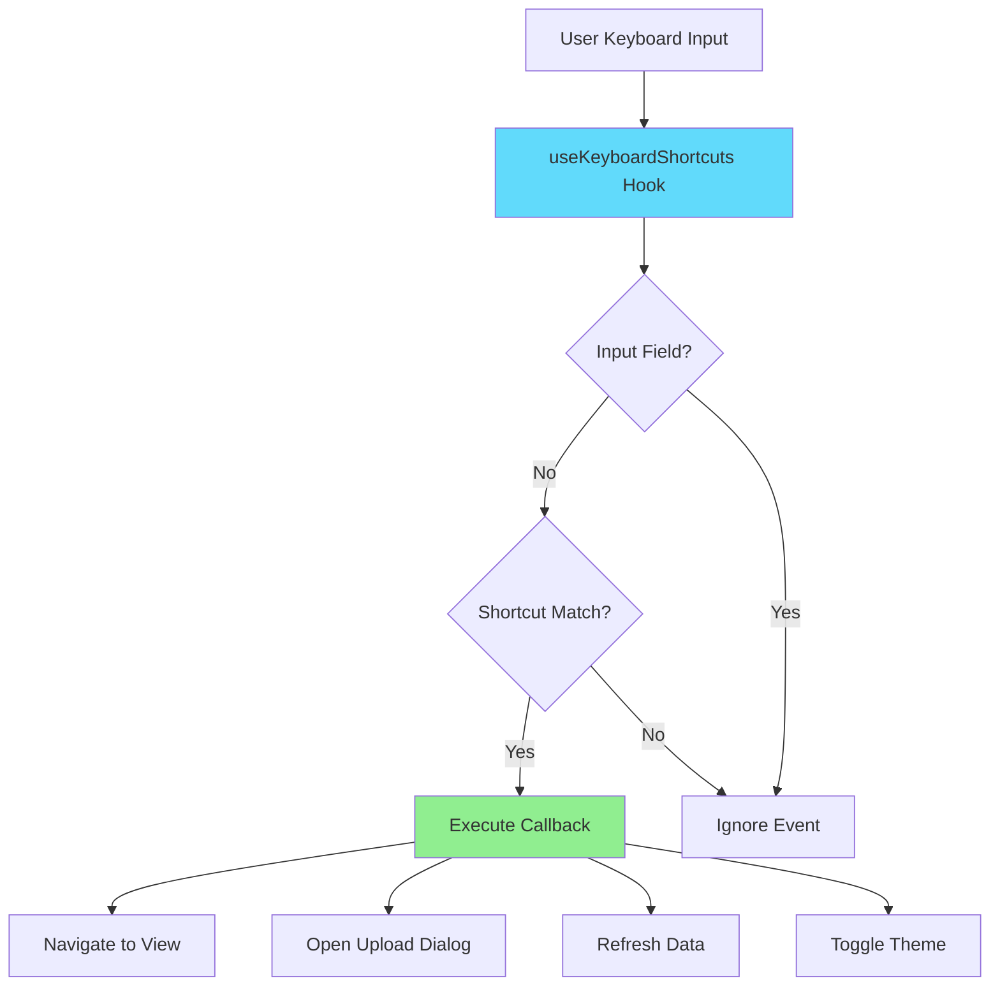

**Available Shortcuts:**
- **Navigation**: `h` (Home), `d` (Devices), `s` (Search), `c` (Compare), `a` (Analytics)
- **Actions**: `Ctrl+U` (Upload), `Ctrl+Shift+T` (Toggle Theme), `Ctrl+R` (Refresh)
- **Help**: `Shift+?` (Show Keyboard Shortcuts Help Modal)

**Implementation Details:**
- Modifier key support (Ctrl, Shift, Alt, Meta)
- Input field awareness (shortcuts disabled when typing)
- Customizable callback functions
- Format helper for display (`formatShortcut()`)

#### Analytics Dashboard

**Data Pipeline:**
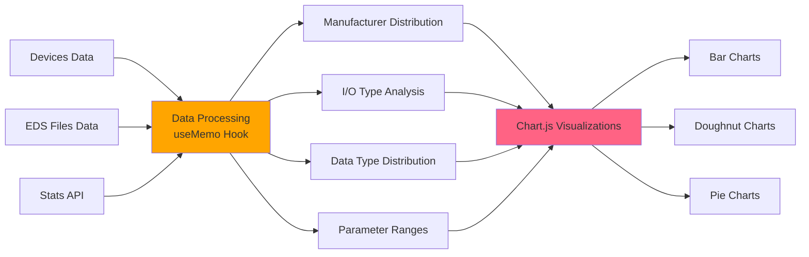

**Features:**
- **Summary Metrics**: Total devices, parameters, EDS files, manufacturers
- **Multi-Tab Interface**: Overview, Devices, Parameters, EDS
- **Chart Types**:
  - Bar Charts (manufacturer/vendor distribution)
  - Doughnut Charts (I/O type distribution)
  - Pie Charts (data type distribution)
- **Time Range Selector**: Last 7/30/90 days, last year
- **Responsive Design**: Adapts to screen size
- **Dark Theme Optimization**: Chart colors optimized for both themes

---

### 4. Frontend (React)

**Component Structure:**
```
App.jsx (Main Container)
├── ThemeProvider (Context)
│   └── ThemeToggle (Sidebar Footer)
├── useKeyboardShortcuts Hook
├── KeyboardShortcutsHelp Modal (Shift+?)
├── Navigation
├── Dashboard/Overview
│   ├── Statistics Cards
│   ├── Recent Devices
│   └── Quick Actions
├── Analytics Dashboard (new)
│   ├── Summary Metrics (4 cards)
│   ├── Tab Navigation
│   │   ├── Overview Tab (I/O Distribution, Param Ranges)
│   │   ├── Devices Tab (Top Manufacturers)
│   │   ├── Parameters Tab (Data Types)
│   │   └── EDS Tab (Vendor Distribution)
│   └── Time Range Selector
├── Device Library (IODD)
│   ├── Search & Filter
│   └── Device Grid
├── EDS Library
│   ├── Search & Filter
│   └── EDS Grid
├── Search Page
│   └── Universal Search
├── Comparison View
│   └── Side-by-Side Device Comparison
└── Device Details
    ├── IODD Details
    │   ├── Overview Tab
    │   ├── Parameters Tab
    │   ├── Menus Tab (Interactive)
    │   │   ├── Menu Navigation
    │   │   ├── Parameter Controls
    │   │   │   ├── Dropdowns (enums)
    │   │   │   ├── Sliders (numeric)
    │   │   │   ├── Checkboxes (boolean)
    │   │   │   └── Text Inputs (string)
    │   │   └── Config Export
    │   ├── Process Data Tab
    │   ├── Errors & Events Tab
    │   └── XML Source Tab
    └── EDS Details
        ├── Overview Tab
        ├── Parameters Tab (284+ params)
        ├── Connections Tab
        ├── Capacity Tab (Visual Gauges)
        └── Raw Content Tab
```

**State Management:**
- React hooks (useState, useEffect, useMemo, useCallback)
- Context API for theme state (ThemeContext)
- Custom hooks (useKeyboardShortcuts, useTheme)
- Local component state for UI
- API data caching in state
- No external state library (Redux/Zustand)

---

### 4. Interactive Menus System

The interactive menus system is a key differentiator, providing full IODD menu rendering with smart controls.

**Architecture:**

```mermaid
graph TD
    IODD[IODD XML<br/>UserInterface]
    Parser[IODDParser<br/>_extract_ui_menus]
    DB[(Database<br/>ui_menus + menu_items)]
    API[API Endpoint<br/>config-schema]
    Enrich[Enrichment Logic<br/>Join with parameters]
    Frontend[Frontend<br/>MenuItemDisplay]
    Controls[Interactive Controls]

    IODD --> Parser
    Parser --> DB
    DB --> API
    API --> Enrich
    Enrich --> Frontend
    Frontend --> Controls

    style IODD fill:#f9f9f9
    style Parser fill:#ffa500
    style DB fill:#003545
    style Frontend fill:#61dafb
```

**Control Selection Logic:**
- Enumeration values → Dropdown/Select
- Boolean → Checkbox/Toggle
- Numeric with range → Slider + Number Input
- String/Other → Text Input
- Read-only → Disabled controls with visual indicator

---

## File Processing Pipeline

```mermaid
flowchart TD
    Start([File Upload])
    Check{File Type?}
    XML[Parse XML]
    ZIP[Extract ZIP]
    Nested{Nested ZIP?}
    ExtractNested[Extract Each ZIP]
    Validate[Validate XML]
    Parse[IODD Parser]
    Store[Store in Database]
    Success([Success Response])

    Start --> Check
    Check -->|.xml| XML
    Check -->|.zip/.iodd| ZIP
    XML --> Validate
    ZIP --> Nested
    Nested -->|Yes| ExtractNested
    Nested -->|No| Validate
    ExtractNested --> Validate
    Validate --> Parse
    Parse --> Store
    Store --> Success

    style Start fill:#90EE90
    style Success fill:#90EE90
    style Parse fill:#ffa500
    style Store fill:#003545
```

---

## Deployment Architecture

### Development Environment

```mermaid
graph LR
    Dev[Developer<br/>Workstation]
    Dev --> API[API Server<br/>localhost:8000]
    Dev --> Frontend[Frontend Dev Server<br/>localhost:5173]
    API --> DB[(SQLite<br/>iodd_manager.db)]
    Frontend -.->|Proxy| API

    style Dev fill:#f0f0f0
    style API fill:#009688
    style Frontend fill:#61dafb
    style DB fill:#003545
```

### Production Environment

```mermaid
graph TB
    Internet((Internet))
    Internet --> Nginx[Nginx<br/>Reverse Proxy<br/>:80/:443]

    subgraph "Application"
        Nginx --> Frontend[Static Frontend<br/>Built React App]
        Nginx --> API[Uvicorn<br/>FastAPI<br/>:8000]
    end

    subgraph "Data"
        API --> DB[(PostgreSQL<br/>or SQLite)]
        API --> Storage[File Storage<br/>Assets]
    end

    style Internet fill:#f0f0f0
    style Nginx fill:#009639
    style Frontend fill:#61dafb
    style API fill:#009688
    style DB fill:#003545
```

---

## Security Architecture

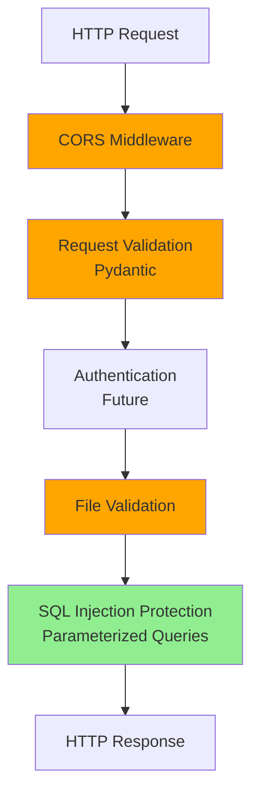

**Security Features:**
- ✅ CORS configuration (localhost origins only)
- ✅ File size limits (10MB default)
- ✅ File type validation (.xml, .zip, .iodd)
- ✅ SQL injection protection (parameterized queries)
- ✅ Path traversal protection (sanitized paths)
- ✅ Input validation (Pydantic models)

---

## Performance Characteristics

### Database Performance

**Indexes:**
- `idx_device_vendor` on `iodd_devices(vendor_id)`
- `idx_params_device` on `parameters(device_id)`
- `idx_menu_device` on `ui_menus(device_id)`

**Query Optimization:**
- Eager loading for related entities
- Connection pooling
- Prepared statements

### API Performance

**Response Times:**
- Device list: < 100ms
- Device details: < 200ms
- File upload: < 5s (depends on file size)
- Config schema: < 300ms (complex join query)

**Scalability:**
- Single Uvicorn worker: 100+ req/s
- Multiple workers: Linear scaling
- SQLite: Suitable for < 1000 devices
- PostgreSQL: Suitable for 10,000+ devices

---

## Error Handling

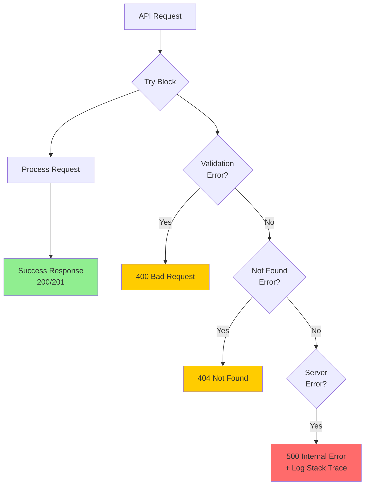

---

## Testing Strategy

**Test Coverage:**
- Unit tests: Core parsing logic
- Integration tests: API endpoints
- Fixture-based tests: Real IODD files

**Test Structure:**
```
tests/
├── conftest.py           # Pytest fixtures
├── test_parser.py        # IODD parser tests
├── test_api.py           # API endpoint tests
├── test_storage.py       # Database tests
└── fixtures/             # Sample IODD files
    ├── sample_device.xml
    └── test_package.zip
```

**Running Tests:**
```bash
# All tests
pytest

# With coverage
pytest --cov=. --cov-report=html

# Specific test file
pytest tests/test_api.py -v
```

---

## Development Workflow

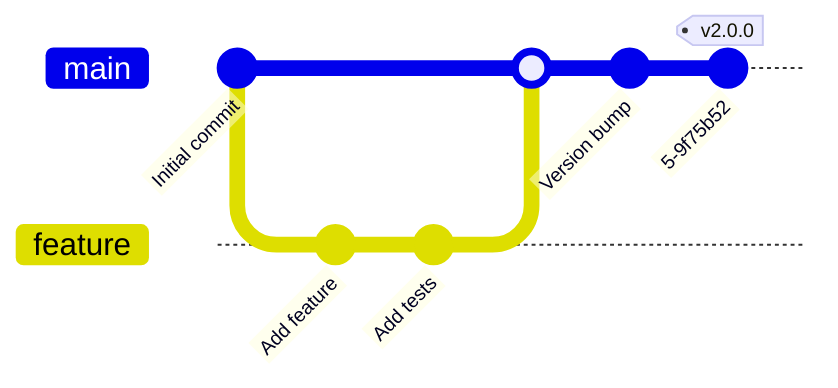

**Workflow Steps:**
1. Create feature branch
2. Implement feature
3. Write tests
4. Run linting (`black`, `ruff`)
5. Run tests (`pytest`)
6. Create pull request
7. Code review
8. Merge to main
9. Deploy

---

## Configuration Management

**Configuration Sources (Priority Order):**
1. Environment variables
2. `.env` file
3. Default values in `config.py`

**Key Configuration Options:**
```python
# Application
ENVIRONMENT = "development"  # development, production, testing
DEBUG = True

# API
API_HOST = "0.0.0.0"
API_PORT = 8000
API_RELOAD = True  # Dev only
API_WORKERS = 4  # Production

# Database
DATABASE_URL = "sqlite:///iodd_manager.db"

# Storage
IODD_STORAGE_PATH = "./iodd_storage"
MAX_UPLOAD_SIZE_MB = 100

# Security
CORS_ORIGINS = "http://localhost:5173,http://localhost:3000"
```

---

## Monitoring & Logging

**Logging Levels:**
- `DEBUG`: Detailed diagnostic information
- `INFO`: General informational messages
- `WARNING`: Warning messages (non-critical)
- `ERROR`: Error messages (handled)
- `CRITICAL`: Critical errors (system failure)

**Log Output:**
```python
# Example log entry
2025-11-12 14:30:45 INFO [api.py:253] IODD file uploaded successfully device_id=42 vendor=ifm
2025-11-12 14:30:46 DEBUG [iodd_manager.py:375] Extracted 147 parameters from IODD
2025-11-12 14:30:47 WARNING [api.py:682] Large menu structure detected menu_items=89
```

---

## Summary

GreenStack is a production-ready intelligent device management platform with:

✅ **Robust Parsing** - Handles complex IODD and EDS files with full spec support
✅ **Modern Architecture** - FastAPI + React with clean separation of concerns
✅ **Advanced UX** - Dark/light theme, keyboard shortcuts, analytics dashboard
✅ **Interactive UI** - Full menu rendering with smart parameter controls
✅ **Rich Analytics** - Chart.js visualizations for data insights
✅ **Scalable Storage** - SQLite for development, PostgreSQL for production
✅ **Comprehensive API** - RESTful endpoints for all device operations
✅ **Security First** - Input validation, SQL protection, CORS configuration
✅ **Well Tested** - 65+ tests with high coverage
✅ **Accessible** - WCAG compliant, keyboard navigation, screen reader support

**New in v2.0+:**
- 🎨 Theme system with system preference detection
- ⌨️ Comprehensive keyboard shortcuts for power users
- 📊 Analytics dashboard with interactive Chart.js visualizations
- 🎯 EDS file support (under development)
- 🚀 Performance optimizations and code splitting

---

**For more information:**
- [Developer Reference](../developer/DEVELOPER_REFERENCE.md)
- [API Endpoints](../developer/API_ENDPOINTS.md)
- [Frontend Architecture](FRONTEND_ARCHITECTURE.md)
- [User Manual](../user/USER_MANUAL.md)
- [User Features Guide](../user/USER_FEATURES.md)
