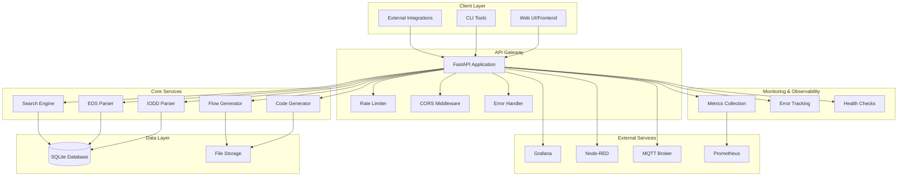
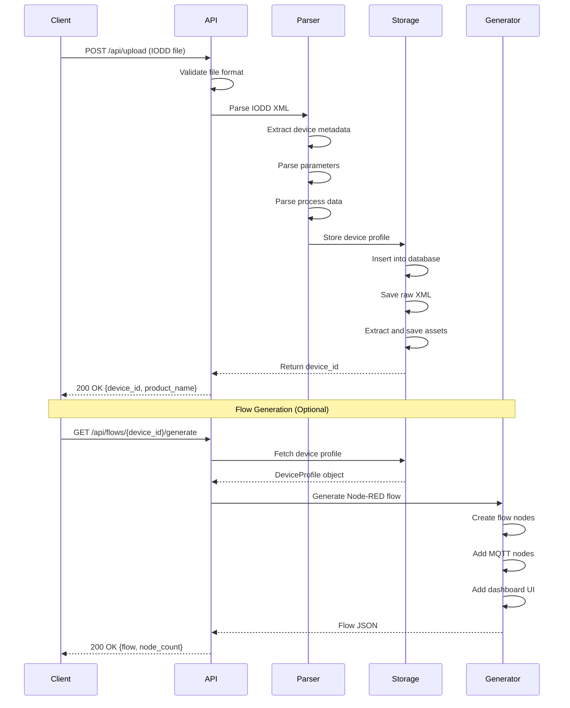
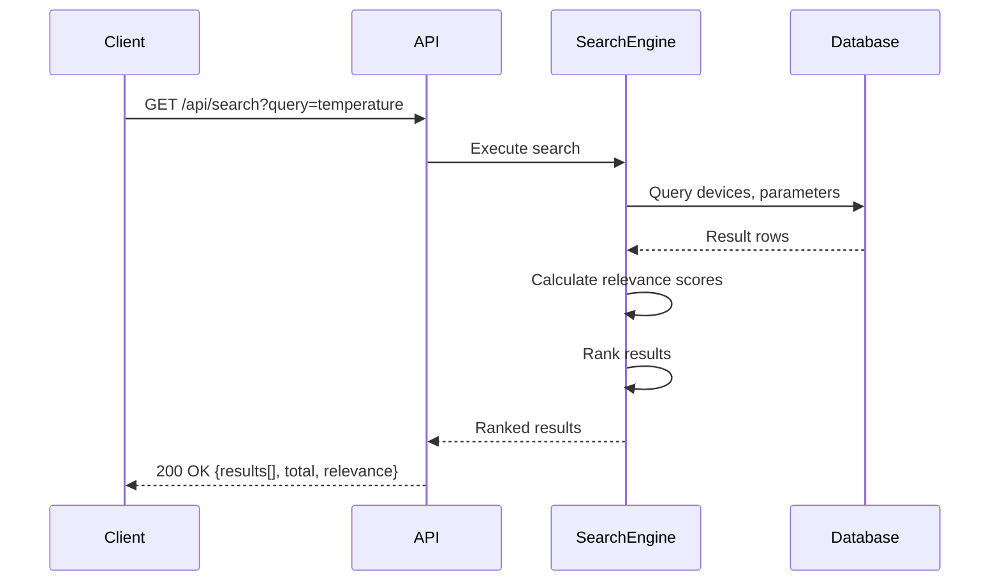
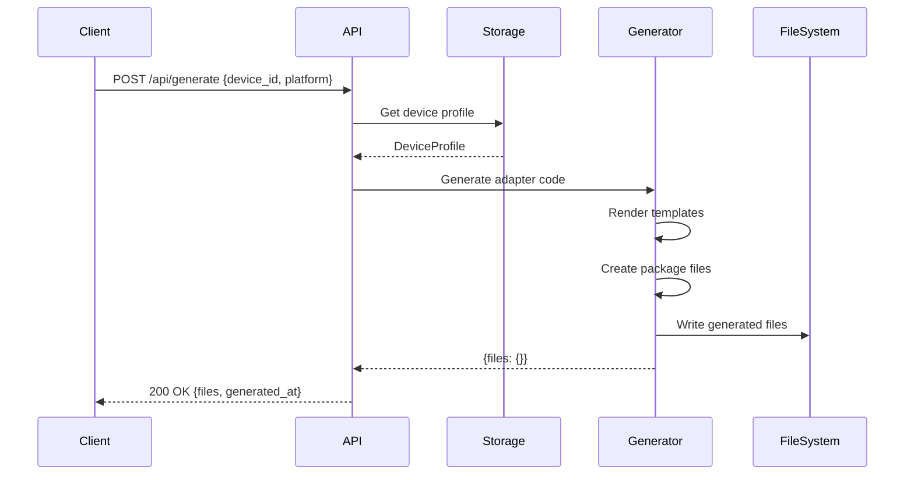
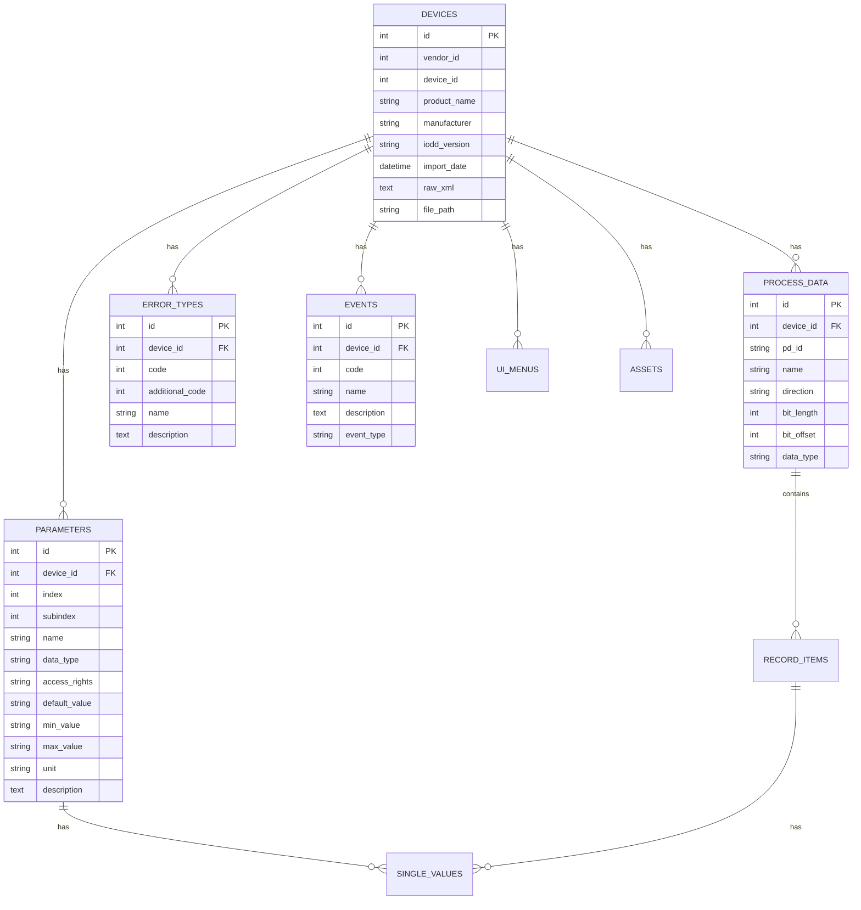
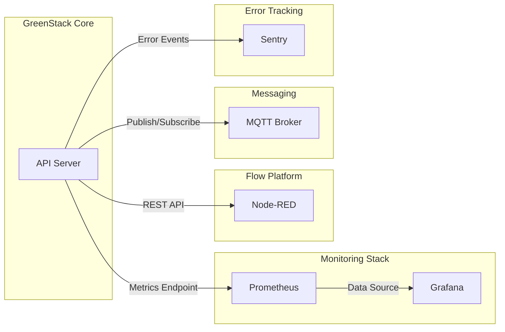
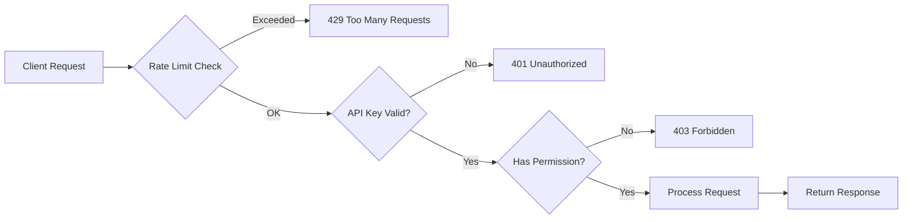

# GreenStack Architecture

**Version**: 1.0.0
**Last Updated**: January 2025

## Table of Contents

- [Overview](#overview)
- [System Architecture](#system-architecture)
- [Component Breakdown](#component-breakdown)
- [Data Flow](#data-flow)
- [Database Schema](#database-schema)
- [Integration Points](#integration-points)
- [Deployment Architecture](#deployment-architecture)
- [Security Model](#security-model)

---

## Overview

GreenStack is a modular, microservices-oriented device management platform that processes industrial device description files (IODD/EDS) and generates integration code for various platforms.

### Key Characteristics

- **Modular Design**: Clear separation of concerns across parsing, storage, generation, and API layers
- **Extensible**: Plugin-based architecture for adding new device protocols and target platforms
- **Production-Ready**: Includes monitoring, rate limiting, error tracking, and quality assurance tools
- **Cloud-Native**: Designed for containerized deployment with Docker/Kubernetes support

---

## System Architecture

### High-Level Architecture



---

## Component Breakdown

### 1. API Layer (`src/api.py`)

**Responsibilities**:
- Expose REST API endpoints
- Handle authentication and rate limiting
- Route requests to appropriate services
- Manage CORS and security headers

**Key Features**:
- FastAPI framework with automatic OpenAPI documentation
- Prometheus metrics instrumentation
- Sentry error tracking integration
- SlowAPI rate limiting per IP
- Production security validation

**Router Organization**:
```
/api
├── /upload          → IODD file upload
├── /devices         → Device management
├── /flows           → Node-RED flow generation
├── /eds             → EDS file management
├── /search          → Device search
├── /config-export   → Configuration export
├── /services        → External service management
├── /admin           → Admin & diagnostics
├── /mqtt            → MQTT configuration
└── /tickets         → Support ticketing
```

---

### 2. Parsing Layer (`src/parsing/`)

**IODD Parser** (`src/parsing/iodd_parser.py`):
- Parses IO-Link Device Description XML files
- Extracts device metadata, parameters, process data, events, errors
- Handles multilingual text content
- Supports variable definitions and data type mappings

**EDS Parser** (`src/parsing/eds_parser.py`):
- Parses EtherNet/IP Electronic Data Sheets
- Extracts device catalog information
- Processes assembly definitions
- Handles connection configurations

**Common Features**:
- XML validation and error handling
- Nested ZIP archive support
- Asset extraction (images, PDFs, documents)
- Comprehensive error reporting

---

### 3. Data Models (`src/models/`)

**Core Models**:
```python
DeviceProfile
├── VendorInfo
├── DeviceInfo
├── Parameter[]
├── ProcessDataCollection
│   ├── ProcessData[] (inputs)
│   └── ProcessData[] (outputs)
├── ErrorType[]
├── Event[]
├── UIMenu[]
├── DeviceFeatures
├── CommunicationProfile
└── Document[]
```

**Enumerations**:
- `IODDDataType`: Device data types (Integer, Float, String, etc.)
- `AccessRights`: Parameter access modes (RO, WO, RW)
- `BitLength`: Standard bit lengths (1, 8, 16, 32, 64)

---

### 4. Storage Layer (`src/storage/`)

**Storage Manager** (`src/storage/storage_manager.py`):
- SQLite database for structured data
- File system for raw IODD/EDS XML and assets
- Device CRUD operations
- Parameter and process data querying
- Search indexing

**Database Tables**:
```
devices
├── parameters
├── process_data
├── error_types
├── events
├── ui_menus
├── assets
├── record_items
└── single_values

eds_devices
├── eds_assemblies
└── eds_connections

tickets
services_status
```

---

### 5. Code Generation (`src/generation/`)

**Node-RED Generator** (`src/generation/nodered_generator.py`):
- Generates Node-RED custom node packages
- Creates `package.json`, `.js`, `.html`, `README.md`
- Handles parameter configuration UI
- Maps process data to node properties

**Flow Generator** (`src/generation/nodered_flows.py`):
- Generates complete Node-RED flows
- Creates MQTT in/out nodes
- Adds function nodes for data parsing
- Builds dashboard UI (gauges, charts, sliders, buttons)
- Supports monitoring, control, and custom flow types

**Adapter Generator** (Abstract):
- Extensible base class for platform adapters
- Plugin architecture for new target platforms

---

### 6. Service Integration (`src/services/`)

**Supported Services**:
- **Grafana**: Dashboard and visualization
- **Node-RED**: Flow-based programming
- **MQTT**: Message broker for device communication
- **Container Management**: Docker/Podman orchestration

**Service Manager**:
- Start/stop/status operations
- Health checks
- Configuration management
- Port conflict detection

---

## Data Flow

### IODD Upload and Processing Flow



---

### Search and Discovery Flow



---

### Code Generation Flow



---

## Database Schema

### Entity Relationship Diagram



### Schema Details

See [DATABASE_SCHEMA.md](./DATABASE_SCHEMA.md) for complete schema documentation.

---

## Integration Points

### External API Integrations



### Service Communication

**Grafana**:
- **Protocol**: HTTP/REST
- **Endpoints**:
  - Dashboard creation: `POST /api/dashboards/db`
  - Datasource config: `POST /api/datasources`
- **Authentication**: API key or basic auth

**Node-RED**:
- **Protocol**: HTTP/REST
- **Endpoints**:
  - Flow deployment: `POST /flows`
  - Node installation: `POST /nodes`
- **Authentication**: Bearer token

**MQTT**:
- **Protocol**: MQTT 3.1.1/5.0
- **Topics**:
  - Device data: `iolink/{vendor_id}/{device_id}/process_data`
  - Commands: `iolink/{vendor_id}/{device_id}/param/write`
- **QoS**: 0 (at most once), 1 (at least once), 2 (exactly once)

---

## Deployment Architecture

### Container Architecture

```mermaid
graph TB
    subgraph "Docker Compose Stack"
        subgraph "Application Container"
            A[GreenStack API<br/>Port: 8000]
        end

        subgraph "Monitoring Containers"
            B[Prometheus<br/>Port: 9090]
            C[Grafana<br/>Port: 3000]
        end

        subgraph "Integration Containers"
            D[Node-RED<br/>Port: 1880]
            E[MQTT Broker<br/>Port: 1883]
        end

        subgraph "Storage Volumes"
            F[/db-data]
            G[/iodd-storage]
            H[/grafana-data]
            I[/nodered-data]
        end
    end

    A -.-> F
    A -.-> G
    B -.-> C
    C -.-> H
    D -.-> I
```

### Production Deployment

**Kubernetes Deployment**:
```yaml
apiVersion: apps/v1
kind: Deployment
metadata:
  name: greenstack-api
spec:
  replicas: 3
  selector:
    matchLabels:
      app: greenstack-api
  template:
    metadata:
      labels:
        app: greenstack-api
    spec:
      containers:
      - name: api
        image: greenstack/api:1.0.0
        ports:
        - containerPort: 8000
        env:
        - name: DATABASE_URL
          value: "postgresql://..."
        - name: SENTRY_DSN
          valueFrom:
            secretKeyRef:
              name: greenstack-secrets
              key: sentry-dsn
```

**Load Balancing**:
- Nginx/HAProxy for HTTP load balancing
- Round-robin or least-connections strategy
- Session affinity optional (stateless API)

---

## Security Model

### Authentication & Authorization



### Security Layers

1. **Network Security**:
   - HTTPS/TLS encryption
   - CORS policy enforcement
   - Rate limiting per IP

2. **Application Security**:
   - Input validation (Pydantic models)
   - SQL injection prevention (parameterized queries)
   - XML parsing limits (prevent billion laughs attack)
   - File upload restrictions (size, type)

3. **Data Security**:
   - Environment-based secrets management
   - No hardcoded credentials
   - Database encryption at rest (optional)

4. **Operational Security**:
   - Sentry error tracking (PII scrubbing)
   - Audit logging
   - Health check endpoints
   - Graceful degradation

### Security Configuration

**Environment Variables**:
```bash
# Authentication
ADMIN_USERNAME=admin
ADMIN_PASSWORD=<strong-password>
SECRET_KEY=<random-secret>

# Rate Limiting
RATE_LIMIT=100/minute

# CORS
CORS_ORIGINS=https://app.example.com,https://dashboard.example.com

# Error Tracking
SENTRY_DSN=https://...@sentry.io/...
ENVIRONMENT=production
```

---

## Performance Considerations

### Optimization Strategies

1. **Database Indexing**:
   - Indexed columns: `device_id`, `vendor_id`, `product_name`
   - Full-text search indexes on descriptions

2. **Caching**:
   - In-memory caching for device profiles (optional)
   - HTTP caching headers for static content
   - Database query result caching

3. **Async Processing**:
   - Background tasks for file processing
   - Async database operations (optional with asyncpg)
   - Queue-based processing for batch operations

4. **Resource Management**:
   - Connection pooling for database
   - File upload size limits (100MB default)
   - Request timeout configuration

---

## Scalability

### Horizontal Scaling

**Stateless Design**:
- No server-side session state
- Database-backed storage only
- Allows multiple API replicas

**Load Distribution**:
- Round-robin load balancing
- Health check-based routing
- Auto-scaling based on CPU/memory

### Vertical Scaling

**Resource Requirements**:
- **Small deployment**: 2 CPU, 4GB RAM
- **Medium deployment**: 4 CPU, 8GB RAM
- **Large deployment**: 8+ CPU, 16GB+ RAM

---

## Monitoring & Observability

### Metrics Collection

**System Metrics**:
- Request rate, latency, error rate
- CPU, memory, disk usage
- Database connection pool stats

**Business Metrics**:
- IODD uploads (success/failure)
- Parse duration histograms
- Device search counts
- Code generation requests
- Flow generation counts

### Health Checks

```
GET /health → Basic health check
GET /metrics → Prometheus metrics
GET /api/services/status → Service status
```

---

## Technology Stack

### Core Technologies

- **Language**: Python 3.11+
- **Framework**: FastAPI 0.100+
- **Database**: SQLite (development), PostgreSQL (production)
- **ORM**: SQLAlchemy 2.0+
- **Validation**: Pydantic 2.0+

### Infrastructure

- **Containerization**: Docker / Docker Compose
- **Orchestration**: Kubernetes (optional)
- **Reverse Proxy**: Nginx / Traefik
- **Monitoring**: Prometheus + Grafana
- **Error Tracking**: Sentry

### Development Tools

- **Testing**: pytest
- **Linting**: ruff, mypy
- **Formatting**: black
- **Documentation**: MkDocs / Sphinx

---

## Future Architecture Enhancements

### Planned Improvements

1. **Microservices Split**:
   - Separate parsing service
   - Dedicated generation service
   - Independent search service

2. **Message Queue Integration**:
   - RabbitMQ / Redis for async tasks
   - Event-driven architecture
   - Background job processing

3. **Advanced Caching**:
   - Redis caching layer
   - CDN integration for static assets
   - Query result caching

4. **Multi-tenancy**:
   - Organization/team isolation
   - Per-tenant databases
   - Resource quotas

5. **GraphQL API**:
   - Alongside REST API
   - Efficient nested queries
   - Real-time subscriptions

---

## References

- [API Reference](./API_REFERENCE.md)
- [Database Schema](./DATABASE_SCHEMA.md)
- [Developer Guide](./DEVELOPER_GUIDE.md)
- [Deployment Guide](./DEPLOYMENT.md)

---

**Version**: 1.0.0
**Last Updated**: January 2025
