# IODD Parser: A Comprehensive Technical Deep Dive

## Building a Standards-Compliant, Modular, and Enterprise-Grade IO-Link Device Description Parser

**Version:** 1.0  
**Date:** November 2025  
**Classification:** Technical Architecture Document

---

## Table of Contents

1. [Executive Summary](#1-executive-summary)
2. [Introduction to IO-Link and IODD](#2-introduction-to-io-link-and-iodd)
3. [IODD Specification Deep Dive](#3-iodd-specification-deep-dive)
4. [Existing Solutions Analysis](#4-existing-solutions-analysis)
5. [Architecture Design](#5-architecture-design)
6. [Core Parser Implementation](#6-core-parser-implementation)
7. [Data Type System](#7-data-type-system)
8. [Validation Engine](#8-validation-engine)
9. [Quality Analysis Framework](#9-quality-analysis-framework)
10. [Schema Management](#10-schema-management)
11. [Integration Capabilities](#11-integration-capabilities)
12. [Testing Strategy](#12-testing-strategy)
13. [Performance Optimization](#13-performance-optimization)
14. [Continuous Improvement Framework](#14-continuous-improvement-framework)
15. [Reference Appendix](#15-reference-appendix)

---

## 1. Executive Summary

This document presents a comprehensive technical specification for building the most robust, standards-compliant IODD (IO Device Description) parser possible. The parser is designed with modularity at its core, enabling continuous improvement while maintaining strict adherence to IO-Link Consortium specifications.

### Key Design Principles

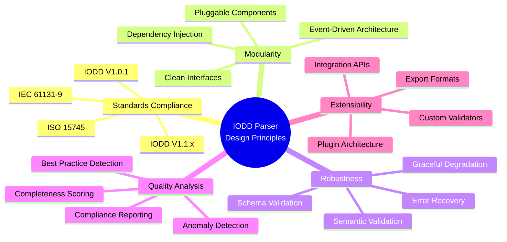
```mermaid
mindmap
  root((IODD Parser<br/>Design Principles))
    Standards Compliance
      IODD V1.0.1
      IODD V1.1.x
      ISO 15745
      IEC 61131-9
    Modularity
      Pluggable Components
      Clean Interfaces
      Dependency Injection
      Event-Driven Architecture
    Robustness
      Schema Validation
      Semantic Validation
      Error Recovery
      Graceful Degradation
    Quality Analysis
      Completeness Scoring
      Best Practice Detection
      Anomaly Detection
      Compliance Reporting
    Extensibility
      Plugin Architecture
      Custom Validators
      Export Formats
      Integration APIs
```

### Target Capabilities

| Capability | Description | Priority |
|------------|-------------|----------|
| Multi-Version Support | Parse IODD V1.0.1, V1.1, V1.1.2, V1.1.3, V1.1.4 | Critical |
| Schema Validation | Full XML Schema validation against official XSDs | Critical |
| Semantic Validation | Business rule validation beyond schema constraints | Critical |
| Data Type Resolution | Complete data type parsing and conversion | Critical |
| Process Data Mapping | Full process data structure extraction | Critical |
| Quality Analysis | Comprehensive IODD quality assessment | High |
| Standard Definitions | Integration with IODD-StandardDefinitions.xml | High |
| IODDfinder Integration | API connectivity for IODD retrieval | Medium |
| Export Capabilities | JSON, OPC UA mapping, code generation | Medium |

---

## 2. Introduction to IO-Link and IODD

### 2.1 IO-Link Technology Overview

IO-Link (IEC 61131-9) is the first globally standardized IO technology for communicating with sensors and actuators. It provides a bi-directional, digital, point-to-point communication interface that enables:

- **Standardized Communication**: Uniform interface regardless of manufacturer
- **Parameterization**: Remote configuration of device settings
- **Diagnostics**: Rich diagnostic data from field devices
- **Device Replacement**: Automatic parameter transfer to replacement devices

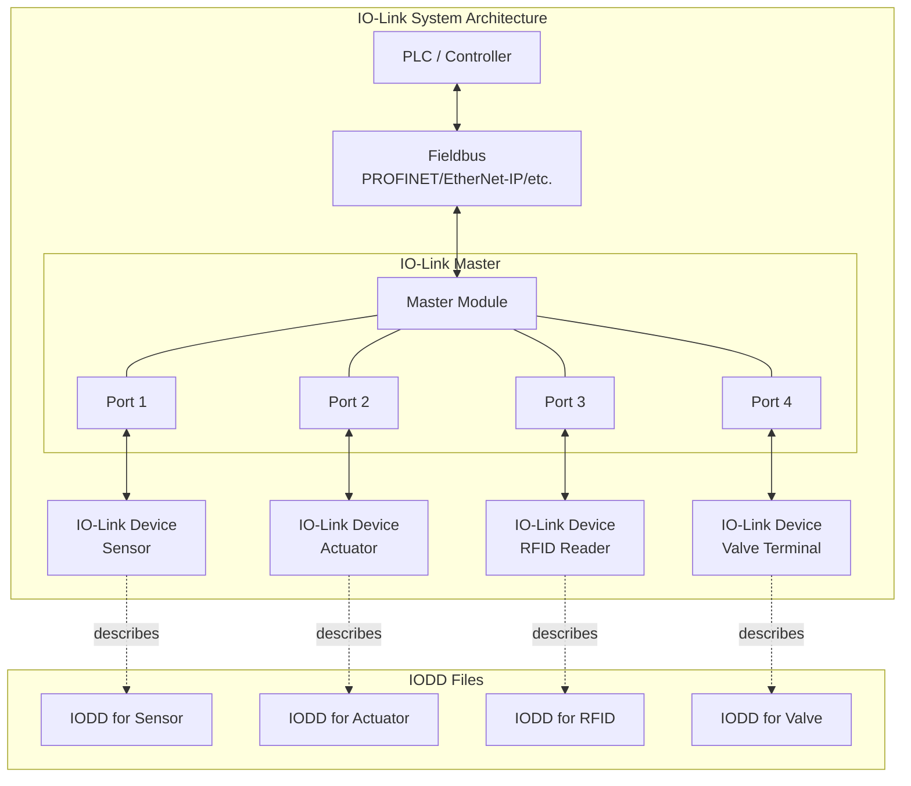
```mermaid
flowchart TB
    subgraph "IO-Link System Architecture"
        PLC[PLC / Controller]
        FB[Fieldbus<br/>PROFINET/EtherNet-IP/etc.]
        
        subgraph "IO-Link Master"
            M[Master Module]
            P1[Port 1]
            P2[Port 2]
            P3[Port 3]
            P4[Port 4]
        end
        
        D1[IO-Link Device<br/>Sensor]
        D2[IO-Link Device<br/>Actuator]
        D3[IO-Link Device<br/>RFID Reader]
        D4[IO-Link Device<br/>Valve Terminal]
        
        PLC <--> FB
        FB <--> M
        M --- P1 & P2 & P3 & P4
        P1 <--> D1
        P2 <--> D2
        P3 <--> D3
        P4 <--> D4
    end
    
    subgraph "IODD Files"
        IODD1[IODD for Sensor]
        IODD2[IODD for Actuator]
        IODD3[IODD for RFID]
        IODD4[IODD for Valve]
    end
    
    D1 -.->|describes| IODD1
    D2 -.->|describes| IODD2
    D3 -.->|describes| IODD3
    D4 -.->|describes| IODD4
```

### 2.2 The Role of IODD

The IODD (IO Device Description) is the electronic datasheet for IO-Link devices. It serves as:

1. **Device Identity Documentation**: Manufacturer, model, variants
2. **Communication Parameters**: Timing, data lengths, modes
3. **Process Data Definition**: Input/output data structures
4. **Parameter Catalog**: All configurable device parameters
5. **Diagnostic Information**: Events, errors, status codes
6. **User Interface Blueprint**: Menu structures for engineering tools

### 2.3 IODD File Structure

An IODD package consists of multiple files:

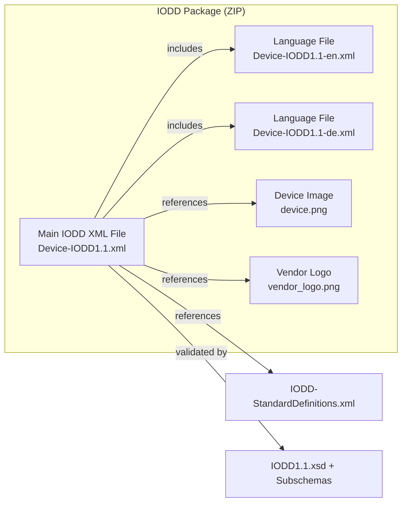
```mermaid
flowchart LR
    subgraph "IODD Package (ZIP)"
        Main[Main IODD XML File<br/>Device-IODD1.1.xml]
        Lang1[Language File<br/>Device-IODD1.1-en.xml]
        Lang2[Language File<br/>Device-IODD1.1-de.xml]
        Img1[Device Image<br/>device.png]
        Img2[Vendor Logo<br/>vendor_logo.png]
    end
    
    Ext[IODD-StandardDefinitions.xml]
    Schema[IODD1.1.xsd + Subschemas]
    
    Main --> |references| Ext
    Main --> |validated by| Schema
    Main --> |includes| Lang1
    Main --> |includes| Lang2
    Main --> |references| Img1
    Main --> |references| Img2
```

---

## 3. IODD Specification Deep Dive

### 3.1 XML Document Structure

The IODD conforms to ISO 15745 "Industrial automation systems and integration – Open systems application integration framework." The root element `<IODevice>` contains the following major sections:

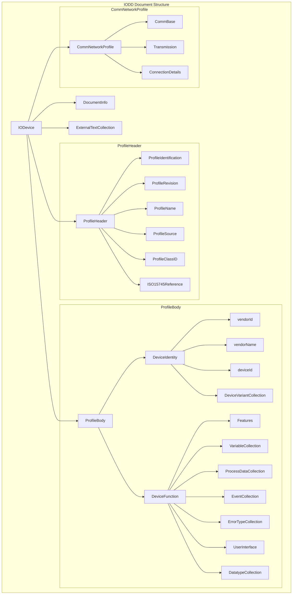
```mermaid
flowchart TB
    subgraph "IODD Document Structure"
        Root[IODevice]
        
        Root --> DocInfo[DocumentInfo]
        Root --> PH[ProfileHeader]
        Root --> PB[ProfileBody]
        Root --> CNP[CommNetworkProfile]
        Root --> ETC[ExternalTextCollection]
        
        subgraph "ProfileHeader"
            PH --> PI[ProfileIdentification]
            PH --> PR[ProfileRevision]
            PH --> PN[ProfileName]
            PH --> PS[ProfileSource]
            PH --> PC[ProfileClassID]
            PH --> ISO[ISO15745Reference]
        end
        
        subgraph "ProfileBody"
            PB --> DI[DeviceIdentity]
            PB --> DF[DeviceFunction]
            
            DI --> VI[vendorId]
            DI --> VN[vendorName]
            DI --> DID[deviceId]
            DI --> DVC[DeviceVariantCollection]
            
            DF --> Feat[Features]
            DF --> VC[VariableCollection]
            DF --> PDC[ProcessDataCollection]
            DF --> EC[EventCollection]
            DF --> ETC2[ErrorTypeCollection]
            DF --> UI[UserInterface]
            DF --> DTC[DatatypeCollection]
        end
        
        subgraph "CommNetworkProfile"
            CNP --> CB[CommBase]
            CNP --> Trans[Transmission]
            CNP --> CD[ConnectionDetails]
        end
    end
```

### 3.2 Key XML Elements Detailed

#### 3.2.1 DeviceIdentity

The `DeviceIdentity` element contains crucial identification information:

```xml
<DeviceIdentity deviceId="123" vendorId="310" vendorName="ifm electronic">
    <VendorText textId="T_VendorText"/>
    <VendorUrl textId="T_VendorUrl"/>
    <VendorLogo name="vendor_logo.png"/>
    <DeviceName textId="T_DeviceName"/>
    <DeviceFamily textId="T_DeviceFamily"/>
    <DeviceVariantCollection>
        <DeviceVariant productId="ABC123">
            <Name textId="TN_Variant1"/>
            <Description textId="TD_Variant1"/>
            <DeviceSymbol name="device_symbol.png"/>
            <DeviceIcon name="device_icon.png"/>
        </DeviceVariant>
    </DeviceVariantCollection>
</DeviceIdentity>
```

| Attribute/Element | Description | Required |
|-------------------|-------------|----------|
| `vendorId` | IO-Link Consortium assigned vendor ID | Yes |
| `vendorName` | Human-readable vendor name | Yes |
| `deviceId` | Vendor-assigned device identifier | Yes |
| `VendorText` | Extended vendor description | No |
| `VendorUrl` | Vendor website URL | No |
| `DeviceName` | Device product name | No (V1.1+) |
| `DeviceVariantCollection` | Product variants | Yes |

#### 3.2.2 DeviceFunction

The `DeviceFunction` element defines all functional aspects:

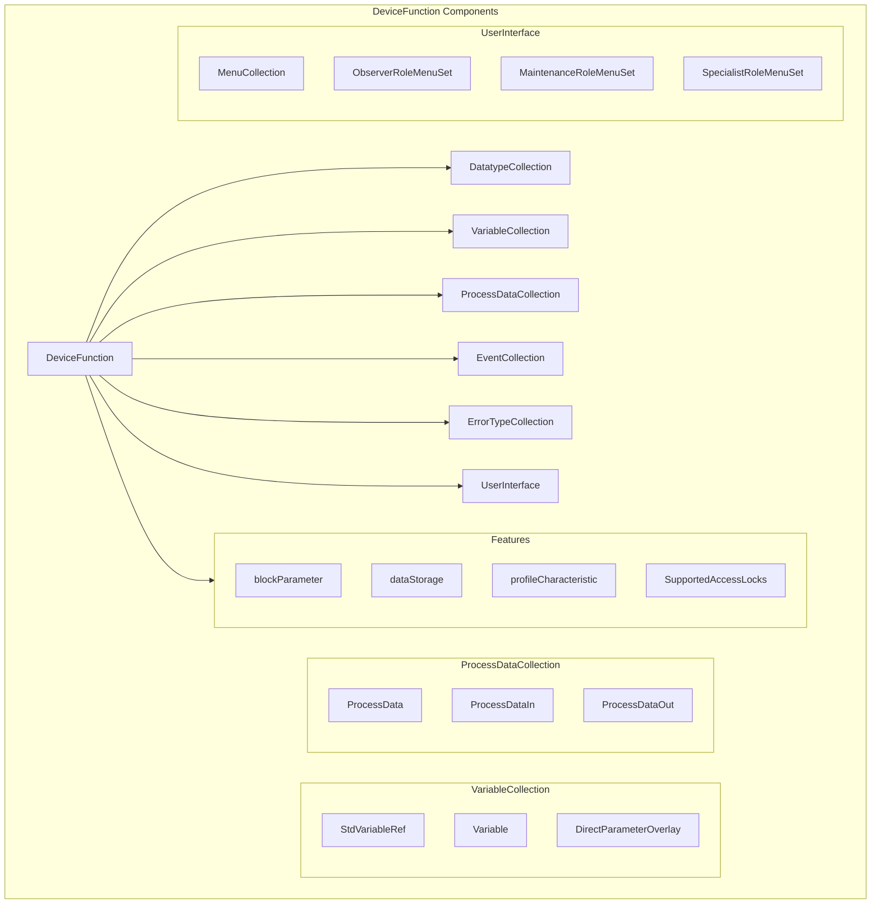
```mermaid
flowchart TB
    subgraph "DeviceFunction Components"
        DF[DeviceFunction]
        
        DF --> Features
        DF --> DTC[DatatypeCollection]
        DF --> VC[VariableCollection]
        DF --> PDC[ProcessDataCollection]
        DF --> EC[EventCollection]
        DF --> ETC[ErrorTypeCollection]
        DF --> UI[UserInterface]
        
        subgraph "Features"
            F1[blockParameter]
            F2[dataStorage]
            F3[profileCharacteristic]
            F4[SupportedAccessLocks]
        end
        
        subgraph "VariableCollection"
            V1[StdVariableRef]
            V2[Variable]
            V3[DirectParameterOverlay]
        end
        
        subgraph "ProcessDataCollection"
            PD1[ProcessData]
            PD2[ProcessDataIn]
            PD3[ProcessDataOut]
        end
        
        subgraph "UserInterface"
            UI1[MenuCollection]
            UI2[ObserverRoleMenuSet]
            UI3[MaintenanceRoleMenuSet]
            UI4[SpecialistRoleMenuSet]
        end
    end
```

### 3.3 Data Types System

IODD defines a rich type system for representing device data:

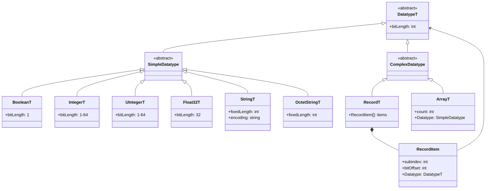
```mermaid
classDiagram
    class DatatypeT {
        <<abstract>>
        +bitLength: int
    }
    
    class SimpleDatatype {
        <<abstract>>
    }
    
    class ComplexDatatype {
        <<abstract>>
    }
    
    class BooleanT {
        +bitLength: 1
    }
    
    class IntegerT {
        +bitLength: 1-64
    }
    
    class UIntegerT {
        +bitLength: 1-64
    }
    
    class Float32T {
        +bitLength: 32
    }
    
    class StringT {
        +fixedLength: int
        +encoding: string
    }
    
    class OctetStringT {
        +fixedLength: int
    }
    
    class RecordT {
        +RecordItem[]: items
    }
    
    class RecordItem {
        +subindex: int
        +bitOffset: int
        +Datatype: DatatypeT
    }
    
    class ArrayT {
        +count: int
        +Datatype: SimpleDatatype
    }
    
    DatatypeT <|-- SimpleDatatype
    DatatypeT <|-- ComplexDatatype
    
    SimpleDatatype <|-- BooleanT
    SimpleDatatype <|-- IntegerT
    SimpleDatatype <|-- UIntegerT
    SimpleDatatype <|-- Float32T
    SimpleDatatype <|-- StringT
    SimpleDatatype <|-- OctetStringT
    
    ComplexDatatype <|-- RecordT
    ComplexDatatype <|-- ArrayT
    
    RecordT *-- RecordItem
    RecordItem --> DatatypeT
```

### 3.4 Standard Definitions Reference

The `IODD-StandardDefinitions.xml` file contains pre-defined elements referenced by IODDs:

| Category | Examples | Index Range |
|----------|----------|-------------|
| Standard Variables | VendorName, ProductName, SerialNumber | 0x0010-0x0018 |
| System Commands | DeviceReset, ApplicationReset, RestoreFactorySettings | 0x0002 |
| Standard Events | Communication lost, Parameter error | 0x1000-0x1FFF |
| Error Types | Communication errors, Parameter errors | Various |

### 3.5 Version Differences

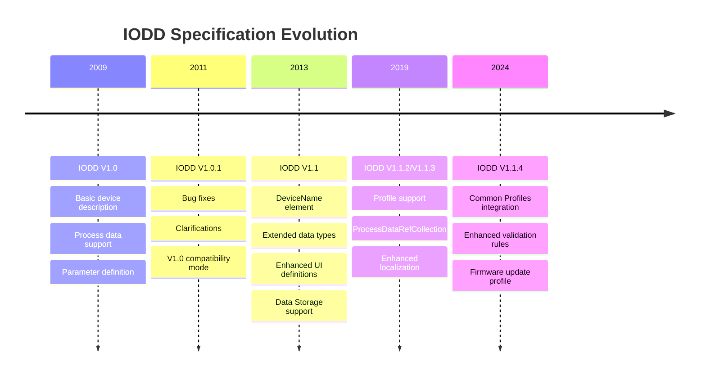
```mermaid
timeline
    title IODD Specification Evolution
    
    2009 : IODD V1.0
         : Basic device description
         : Process data support
         : Parameter definition
    
    2011 : IODD V1.0.1
         : Bug fixes
         : Clarifications
         : V1.0 compatibility mode
    
    2013 : IODD V1.1
         : DeviceName element
         : Extended data types
         : Enhanced UI definitions
         : Data Storage support
    
    2019 : IODD V1.1.2/V1.1.3
         : Profile support
         : ProcessDataRefCollection
         : Enhanced localization
    
    2024 : IODD V1.1.4
         : Common Profiles integration
         : Enhanced validation rules
         : Firmware update profile
```

---

## 4. Existing Solutions Analysis

### 4.1 Commercial Solutions

#### 4.1.1 TEConcept IODD Parser

**Overview**: TEConcept GmbH offers a commercial embedded IODD parser designed for integration into IO-Link master hardware.

**Key Features**:
- Complies with IODD V1.0 and V1.1 specifications
- Written in C for embedded systems
- Parses IODD to hierarchical memory model
- Average parsed size: ~20KB
- Maximum tested size: ~100KB

**Limitations**:
- Proprietary, closed-source
- Primarily targets embedded systems
- Limited extensibility
- No quality analysis capabilities
- No standalone validation tools

#### 4.1.2 TEConcept IODD Studio/Designer

**Overview**: GUI tools for creating and editing IODDs.

**Key Features**:
- Visual IODD editing
- Custom validation rules
- Integration with IODD Checker

**Limitations**:
- Creation-focused, not parsing-focused
- Limited API access
- Windows-only

#### 4.1.3 Vendor-Specific Tools

| Vendor | Tool | Limitations |
|--------|------|-------------|
| ifm | moneo, LR DEVICE | Proprietary, vendor-locked |
| SICK | FieldEcho | Limited to SICK ecosystem |
| Balluff | BET/Engineering Tool | Closed system |
| Siemens | TIA Portal | Requires Siemens infrastructure |
| Beckhoff | TwinCAT | Beckhoff ecosystem only |

### 4.2 Open Source Solutions

#### 4.2.1 IOLink.NET (domdeger/IOLink.NET)

**Overview**: C# .NET library for IO-Link data and devices.

**Architecture**:
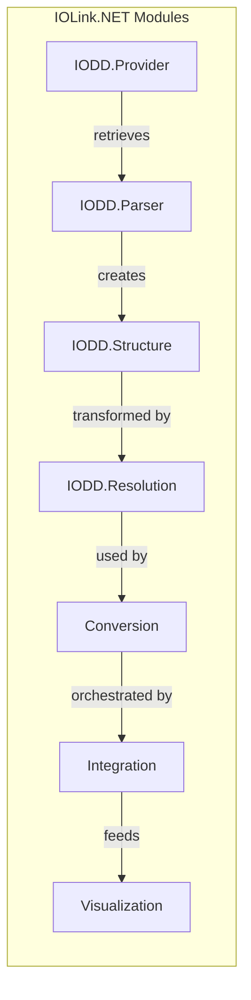
```mermaid
flowchart LR
    subgraph "IOLink.NET Modules"
        Provider[IODD.Provider]
        Parser[IODD.Parser]
        Structure[IODD.Structure]
        Resolution[IODD.Resolution]
        Conversion[Conversion]
        Integration[Integration]
        Visualization[Visualization]
    end
    
    Provider -->|retrieves| Parser
    Parser -->|creates| Structure
    Structure -->|transformed by| Resolution
    Resolution -->|used by| Conversion
    Conversion -->|orchestrated by| Integration
    Integration -->|feeds| Visualization
```

**Strengths**:
- Modular architecture
- .NET ecosystem integration
- Active development
- Open source (Apache/MIT)

**Limitations**:
- Still under development, not feature-complete
- Limited validation beyond schema
- No quality analysis
- .NET dependency
- Limited vendor support testing

#### 4.2.2 ioddengine (Rust)

**Overview**: Rust-based IODD parser with CLI interface.

**Key Features**:
- Parse PDIn data
- Parameter encoding/decoding
- Menu navigation
- Catalog management

**Limitations**:
- Only targets IODD V1.1
- Limited documentation
- No validation engine
- No quality analysis
- CLI-focused, limited library use

#### 4.2.3 CSK_Module_IODDInterpreter (SICK AppSpace)

**Overview**: Lua-based IODD interpreter for SICK AppSpace platform.

**Limitations**:
- SICK AppSpace ecosystem only
- Lua implementation
- Limited to specific use case
- Not general-purpose

### 4.3 Official IO-Link Tools

#### 4.3.1 IODD Checker

**Overview**: Official validation tool from IO-Link Consortium.

**Capabilities**:
- XML Schema validation
- Semantic rule validation
- Mandatory "stamping" for IODDfinder upload
- Error/warning reporting

**Limitations**:
- Validation only, no parsing API
- Closed source
- Windows executable
- No programmatic integration
- No quality scoring

#### 4.3.2 IODD Viewer

**Overview**: Human-readable IODD visualization tool.

**Limitations**:
- View-only, no parsing API
- No data extraction capabilities
- GUI tool only

### 4.4 Gap Analysis

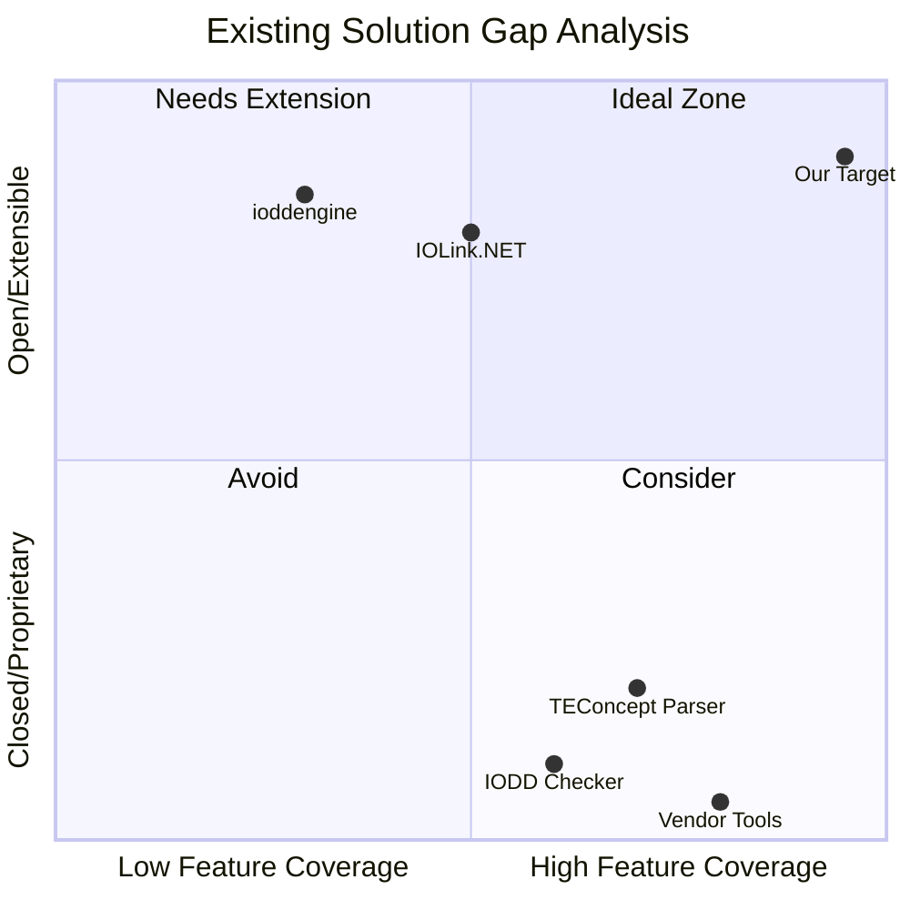
```mermaid
quadrantChart
    title Existing Solution Gap Analysis
    x-axis Low Feature Coverage --> High Feature Coverage
    y-axis Closed/Proprietary --> Open/Extensible
    quadrant-1 "Ideal Zone"
    quadrant-2 "Needs Extension"
    quadrant-3 "Avoid"
    quadrant-4 "Consider"
    
    "TEConcept Parser": [0.7, 0.2]
    "IOLink.NET": [0.5, 0.8]
    "ioddengine": [0.3, 0.85]
    "IODD Checker": [0.6, 0.1]
    "Vendor Tools": [0.8, 0.05]
    "Our Target": [0.95, 0.9]
```

### 4.5 Requirements Not Met by Existing Solutions

| Requirement | TEConcept | IOLink.NET | ioddengine | IODD Checker |
|-------------|-----------|------------|------------|--------------|
| Multi-version support | ⚠️ | ⚠️ | ❌ | ✅ |
| Full schema validation | ✅ | ⚠️ | ❌ | ✅ |
| Semantic validation | ⚠️ | ❌ | ❌ | ✅ |
| Quality analysis | ❌ | ❌ | ❌ | ❌ |
| Extensible architecture | ❌ | ✅ | ⚠️ | ❌ |
| Open source | ❌ | ✅ | ✅ | ❌ |
| Language agnostic | ❌ | ❌ | ❌ | ❌ |
| CI/CD integration | ❌ | ⚠️ | ⚠️ | ❌ |
| Export formats | ❌ | ⚠️ | ❌ | ❌ |
| IODDfinder API | ❌ | ✅ | ❌ | ❌ |

**Legend**: ✅ Full support | ⚠️ Partial support | ❌ Not supported

---

## 5. Architecture Design

### 5.1 High-Level Architecture

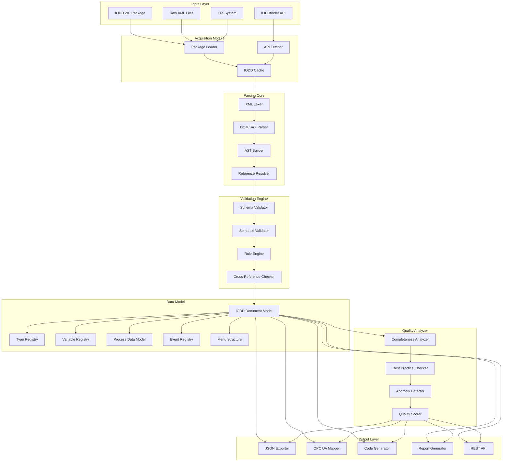
```mermaid
flowchart TB
    subgraph "Input Layer"
        ZIP[IODD ZIP Package]
        XML[Raw XML Files]
        API[IODDfinder API]
        FS[File System]
    end
    
    subgraph "Acquisition Module"
        Loader[Package Loader]
        Fetcher[API Fetcher]
        Cache[IODD Cache]
    end
    
    subgraph "Parsing Core"
        Lexer[XML Lexer]
        Parser[DOM/SAX Parser]
        Builder[AST Builder]
        Resolver[Reference Resolver]
    end
    
    subgraph "Validation Engine"
        SchemaVal[Schema Validator]
        SemanticVal[Semantic Validator]
        RuleEngine[Rule Engine]
        CrossRef[Cross-Reference Checker]
    end
    
    subgraph "Data Model"
        DOM[IODD Document Model]
        Types[Type Registry]
        Vars[Variable Registry]
        Process[Process Data Model]
        Events[Event Registry]
        Menus[Menu Structure]
    end
    
    subgraph "Quality Analyzer"
        Complete[Completeness Analyzer]
        BestPrac[Best Practice Checker]
        Anomaly[Anomaly Detector]
        Scorer[Quality Scorer]
    end
    
    subgraph "Output Layer"
        JSON[JSON Exporter]
        OPCUA[OPC UA Mapper]
        Code[Code Generator]
        Report[Report Generator]
        API_Out[REST API]
    end
    
    ZIP & XML --> Loader
    API --> Fetcher
    FS --> Loader
    
    Loader --> Cache
    Fetcher --> Cache
    Cache --> Lexer
    
    Lexer --> Parser
    Parser --> Builder
    Builder --> Resolver
    
    Resolver --> SchemaVal
    SchemaVal --> SemanticVal
    SemanticVal --> RuleEngine
    RuleEngine --> CrossRef
    
    CrossRef --> DOM
    DOM --> Types & Vars & Process & Events & Menus
    
    DOM --> Complete
    Complete --> BestPrac
    BestPrac --> Anomaly
    Anomaly --> Scorer
    
    DOM & Scorer --> JSON & OPCUA & Code & Report & API_Out
```

### 5.2 Module Breakdown

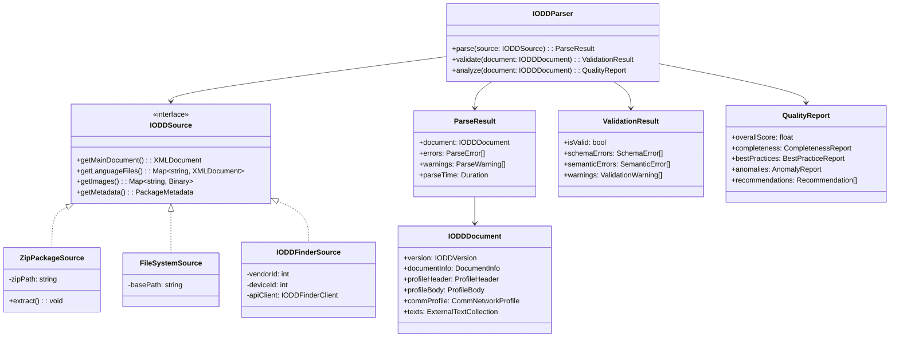
```mermaid
classDiagram
    class IODDParser {
        +parse(source: IODDSource): ParseResult
        +validate(document: IODDDocument): ValidationResult
        +analyze(document: IODDDocument): QualityReport
    }
    
    class IODDSource {
        <<interface>>
        +getMainDocument(): XMLDocument
        +getLanguageFiles(): Map~string, XMLDocument~
        +getImages(): Map~string, Binary~
        +getMetadata(): PackageMetadata
    }
    
    class ZipPackageSource {
        -zipPath: string
        +extract(): void
    }
    
    class FileSystemSource {
        -basePath: string
    }
    
    class IODDFinderSource {
        -vendorId: int
        -deviceId: int
        -apiClient: IODDFinderClient
    }
    
    class ParseResult {
        +document: IODDDocument
        +errors: ParseError[]
        +warnings: ParseWarning[]
        +parseTime: Duration
    }
    
    class IODDDocument {
        +version: IODDVersion
        +documentInfo: DocumentInfo
        +profileHeader: ProfileHeader
        +profileBody: ProfileBody
        +commProfile: CommNetworkProfile
        +texts: ExternalTextCollection
    }
    
    class ValidationResult {
        +isValid: bool
        +schemaErrors: SchemaError[]
        +semanticErrors: SemanticError[]
        +warnings: ValidationWarning[]
    }
    
    class QualityReport {
        +overallScore: float
        +completeness: CompletenessReport
        +bestPractices: BestPracticeReport
        +anomalies: AnomalyReport
        +recommendations: Recommendation[]
    }
    
    IODDSource <|.. ZipPackageSource
    IODDSource <|.. FileSystemSource
    IODDSource <|.. IODDFinderSource
    
    IODDParser --> IODDSource
    IODDParser --> ParseResult
    IODDParser --> ValidationResult
    IODDParser --> QualityReport
    
    ParseResult --> IODDDocument
```

### 5.3 Plugin Architecture

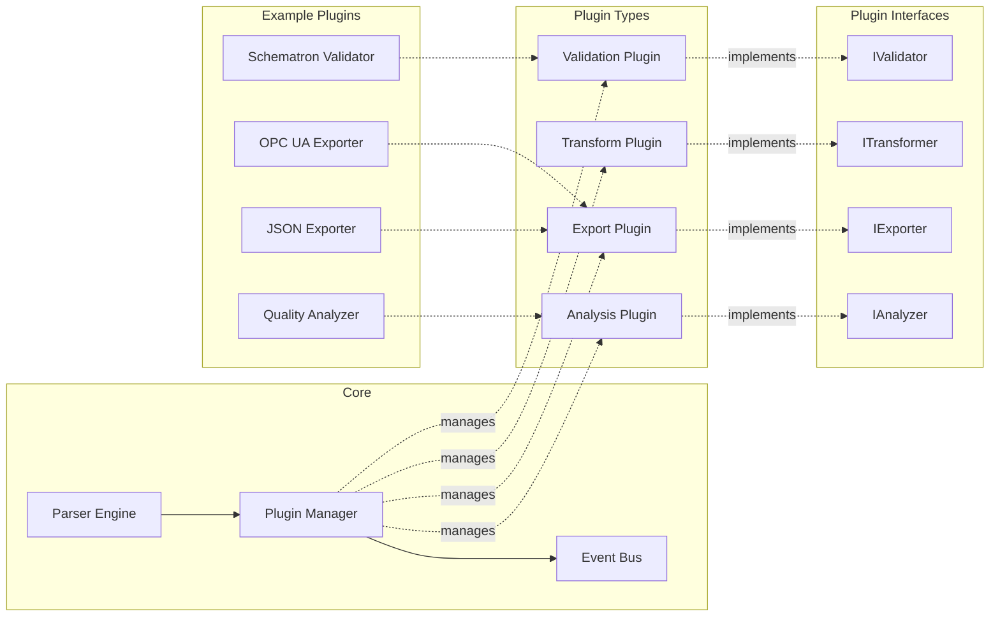
```mermaid
flowchart LR
    subgraph "Core"
        Engine[Parser Engine]
        PluginMgr[Plugin Manager]
        EventBus[Event Bus]
    end
    
    subgraph "Plugin Types"
        ValPlugin[Validation Plugin]
        TransPlugin[Transform Plugin]
        ExportPlugin[Export Plugin]
        AnalyzePlugin[Analysis Plugin]
    end
    
    subgraph "Plugin Interfaces"
        IValidator[IValidator]
        ITransformer[ITransformer]
        IExporter[IExporter]
        IAnalyzer[IAnalyzer]
    end
    
    subgraph "Example Plugins"
        SchematronVal[Schematron Validator]
        OPCUAExport[OPC UA Exporter]
        JSONExport[JSON Exporter]
        QualityAnalyzer[Quality Analyzer]
    end
    
    Engine --> PluginMgr
    PluginMgr --> EventBus
    
    PluginMgr -.->|manages| ValPlugin & TransPlugin & ExportPlugin & AnalyzePlugin
    
    ValPlugin -.->|implements| IValidator
    TransPlugin -.->|implements| ITransformer
    ExportPlugin -.->|implements| IExporter
    AnalyzePlugin -.->|implements| IAnalyzer
    
    SchematronVal -.-> ValPlugin
    OPCUAExport -.-> ExportPlugin
    JSONExport -.-> ExportPlugin
    QualityAnalyzer -.-> AnalyzePlugin
```

### 5.4 Data Flow

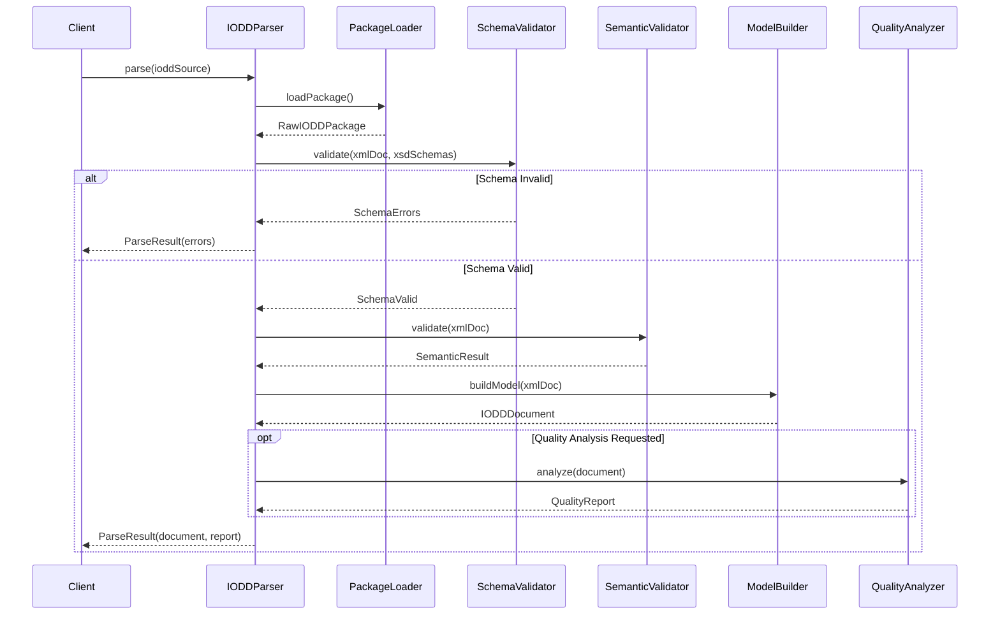
```mermaid
sequenceDiagram
    participant Client
    participant Parser as IODDParser
    participant Loader as PackageLoader
    participant Schema as SchemaValidator
    participant Semantic as SemanticValidator
    participant Builder as ModelBuilder
    participant Quality as QualityAnalyzer
    
    Client->>Parser: parse(ioddSource)
    Parser->>Loader: loadPackage()
    Loader-->>Parser: RawIODDPackage
    
    Parser->>Schema: validate(xmlDoc, xsdSchemas)
    alt Schema Invalid
        Schema-->>Parser: SchemaErrors
        Parser-->>Client: ParseResult(errors)
    else Schema Valid
        Schema-->>Parser: SchemaValid
        
        Parser->>Semantic: validate(xmlDoc)
        Semantic-->>Parser: SemanticResult
        
        Parser->>Builder: buildModel(xmlDoc)
        Builder-->>Parser: IODDDocument
        
        opt Quality Analysis Requested
            Parser->>Quality: analyze(document)
            Quality-->>Parser: QualityReport
        end
        
        Parser-->>Client: ParseResult(document, report)
    end
```

---

## 6. Core Parser Implementation

### 6.1 Parsing Strategy

The parser employs a multi-phase approach:

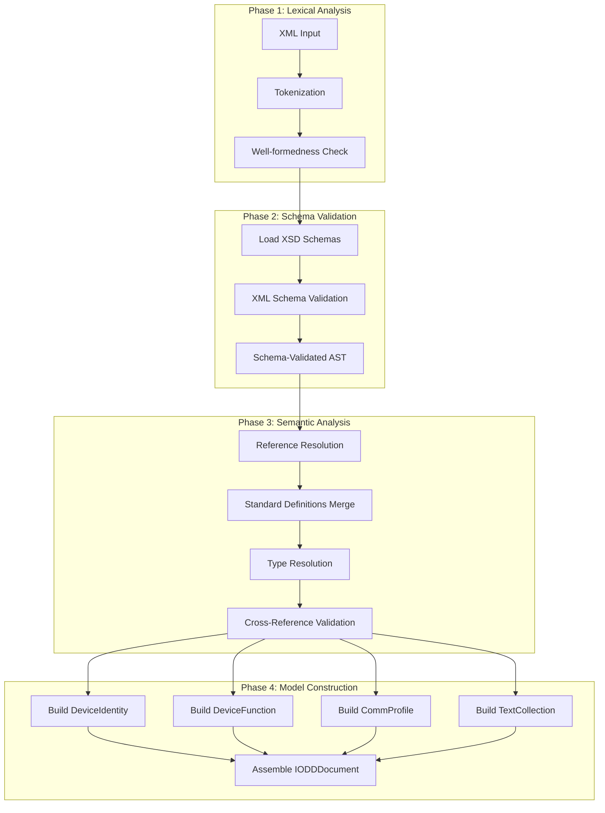
```mermaid
flowchart TB
    subgraph "Phase 1: Lexical Analysis"
        XML[XML Input]
        Tokenize[Tokenization]
        WellForm[Well-formedness Check]
    end
    
    subgraph "Phase 2: Schema Validation"
        LoadXSD[Load XSD Schemas]
        Validate[XML Schema Validation]
        SchemaAST[Schema-Validated AST]
    end
    
    subgraph "Phase 3: Semantic Analysis"
        RefResolve[Reference Resolution]
        StdDef[Standard Definitions Merge]
        TypeResolve[Type Resolution]
        CrossRef[Cross-Reference Validation]
    end
    
    subgraph "Phase 4: Model Construction"
        Identity[Build DeviceIdentity]
        Function[Build DeviceFunction]
        Comm[Build CommProfile]
        Text[Build TextCollection]
        Final[Assemble IODDDocument]
    end
    
    XML --> Tokenize --> WellForm
    WellForm --> LoadXSD --> Validate --> SchemaAST
    SchemaAST --> RefResolve --> StdDef --> TypeResolve --> CrossRef
    CrossRef --> Identity & Function & Comm & Text --> Final
```

### 6.2 Reference Resolution

IODD files contain multiple reference types that must be resolved:

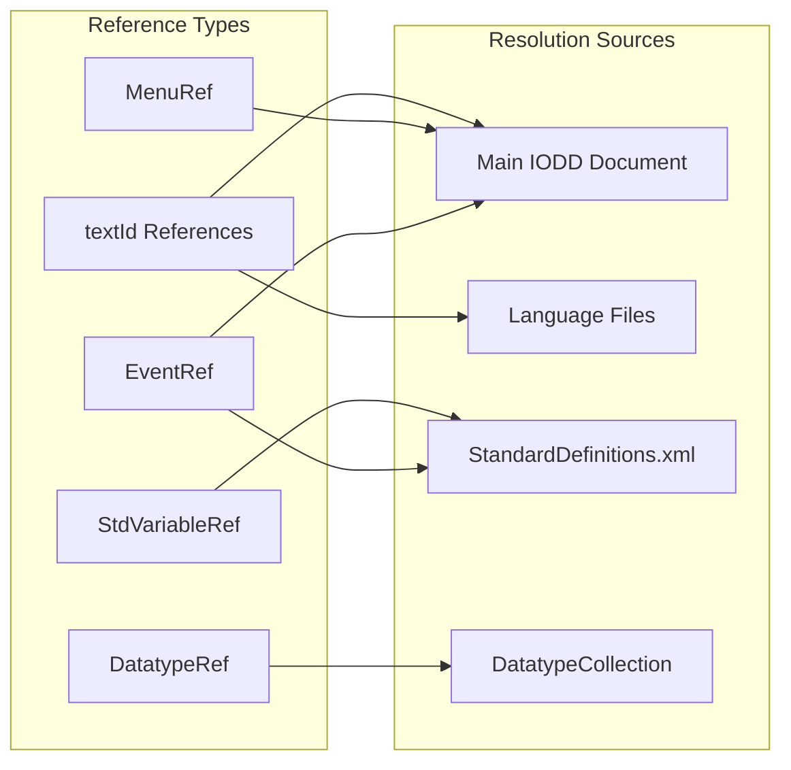
```mermaid
flowchart LR
    subgraph "Reference Types"
        TextRef[textId References]
        VarRef[StdVariableRef]
        TypeRef[DatatypeRef]
        MenuRef[MenuRef]
        EventRef[EventRef]
    end
    
    subgraph "Resolution Sources"
        MainDoc[Main IODD Document]
        LangFiles[Language Files]
        StdDefs[StandardDefinitions.xml]
        TypeDefs[DatatypeCollection]
    end
    
    TextRef --> LangFiles
    TextRef --> MainDoc
    VarRef --> StdDefs
    TypeRef --> TypeDefs
    MenuRef --> MainDoc
    EventRef --> StdDefs
    EventRef --> MainDoc
```

### 6.3 Core Data Structures

```python
# Pseudocode representation of core data structures

@dataclass
class IODDDocument:
    version: IODDVersion
    document_info: DocumentInfo
    profile_header: ProfileHeader
    device_identity: DeviceIdentity
    device_function: DeviceFunction
    comm_network_profile: CommNetworkProfile
    external_texts: Dict[str, Dict[str, str]]  # lang -> textId -> value
    images: Dict[str, bytes]
    
@dataclass  
class DeviceIdentity:
    vendor_id: int
    vendor_name: str
    device_id: int
    vendor_text: Optional[str]
    vendor_url: Optional[str]
    vendor_logo: Optional[str]
    device_name: Optional[str]
    device_family: Optional[str]
    device_variants: List[DeviceVariant]

@dataclass
class DeviceFunction:
    features: Features
    datatypes: Dict[str, Datatype]
    variables: Dict[str, Variable]
    process_data: ProcessDataCollection
    events: Dict[str, Event]
    error_types: Dict[str, ErrorType]
    user_interface: UserInterface

@dataclass
class Variable:
    id: str
    index: int
    subindex: Optional[int]
    access_rights: AccessRights  # ro, wo, rw
    datatype: Datatype
    default_value: Optional[Any]
    name: str
    description: Optional[str]
    unit_code: Optional[int]
    
@dataclass
class ProcessData:
    id: str
    condition: Optional[Condition]
    process_data_in: Optional[ProcessDataItem]
    process_data_out: Optional[ProcessDataItem]
    
@dataclass
class ProcessDataItem:
    id: str
    bit_length: int
    datatype: Datatype
    name: str
```

### 6.4 Error Handling Strategy

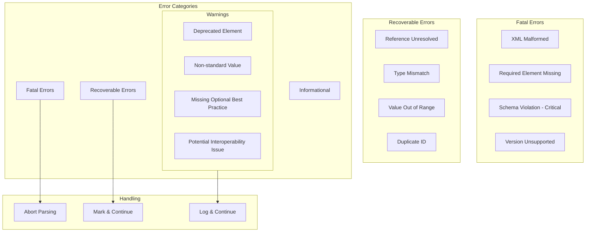
```mermaid
flowchart TB
    subgraph "Error Categories"
        Fatal[Fatal Errors]
        Recoverable[Recoverable Errors]
        Warnings[Warnings]
        Info[Informational]
    end
    
    subgraph "Fatal Errors"
        F1[XML Malformed]
        F2[Required Element Missing]
        F3[Schema Violation - Critical]
        F4[Version Unsupported]
    end
    
    subgraph "Recoverable Errors"
        R1[Reference Unresolved]
        R2[Type Mismatch]
        R3[Value Out of Range]
        R4[Duplicate ID]
    end
    
    subgraph "Warnings"
        W1[Deprecated Element]
        W2[Non-standard Value]
        W3[Missing Optional Best Practice]
        W4[Potential Interoperability Issue]
    end
    
    subgraph "Handling"
        FatalH[Abort Parsing]
        RecoverH[Mark & Continue]
        WarnH[Log & Continue]
    end
    
    Fatal --> FatalH
    Recoverable --> RecoverH
    Warnings --> WarnH
```

---

## 7. Data Type System

### 7.1 Type Hierarchy Implementation

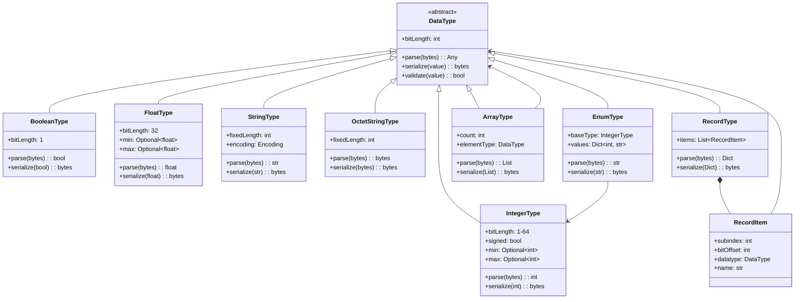
```mermaid
classDiagram
    class DataType {
        <<abstract>>
        +bitLength: int
        +parse(bytes): Any
        +serialize(value): bytes
        +validate(value): bool
    }
    
    class BooleanType {
        +bitLength: 1
        +parse(bytes): bool
        +serialize(bool): bytes
    }
    
    class IntegerType {
        +bitLength: 1-64
        +signed: bool
        +min: Optional~int~
        +max: Optional~int~
        +parse(bytes): int
        +serialize(int): bytes
    }
    
    class FloatType {
        +bitLength: 32
        +min: Optional~float~
        +max: Optional~float~
        +parse(bytes): float
        +serialize(float): bytes
    }
    
    class StringType {
        +fixedLength: int
        +encoding: Encoding
        +parse(bytes): str
        +serialize(str): bytes
    }
    
    class OctetStringType {
        +fixedLength: int
        +parse(bytes): bytes
        +serialize(bytes): bytes
    }
    
    class RecordType {
        +items: List~RecordItem~
        +parse(bytes): Dict
        +serialize(Dict): bytes
    }
    
    class RecordItem {
        +subindex: int
        +bitOffset: int
        +datatype: DataType
        +name: str
    }
    
    class ArrayType {
        +count: int
        +elementType: DataType
        +parse(bytes): List
        +serialize(List): bytes
    }
    
    class EnumType {
        +baseType: IntegerType
        +values: Dict~int, str~
        +parse(bytes): str
        +serialize(str): bytes
    }
    
    DataType <|-- BooleanType
    DataType <|-- IntegerType
    DataType <|-- FloatType
    DataType <|-- StringType
    DataType <|-- OctetStringType
    DataType <|-- RecordType
    DataType <|-- ArrayType
    DataType <|-- EnumType
    
    RecordType *-- RecordItem
    RecordItem --> DataType
    ArrayType --> DataType
    EnumType --> IntegerType
```

### 7.2 Type Resolution Algorithm

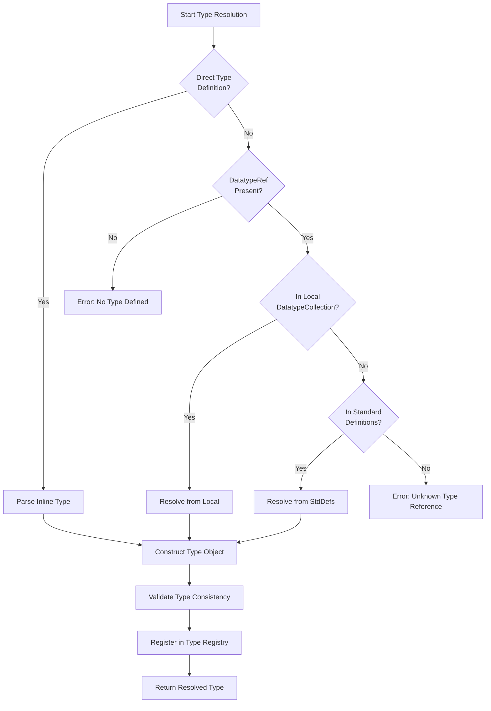
```mermaid
flowchart TB
    Start[Start Type Resolution]
    
    Start --> CheckDirect{Direct Type<br/>Definition?}
    
    CheckDirect -->|Yes| ParseDirect[Parse Inline Type]
    CheckDirect -->|No| CheckRef{DatatypeRef<br/>Present?}
    
    CheckRef -->|Yes| LookupLocal{In Local<br/>DatatypeCollection?}
    CheckRef -->|No| Error1[Error: No Type Defined]
    
    LookupLocal -->|Yes| ResolveLocal[Resolve from Local]
    LookupLocal -->|No| LookupStd{In Standard<br/>Definitions?}
    
    LookupStd -->|Yes| ResolveStd[Resolve from StdDefs]
    LookupStd -->|No| Error2[Error: Unknown Type Reference]
    
    ParseDirect --> Construct[Construct Type Object]
    ResolveLocal --> Construct
    ResolveStd --> Construct
    
    Construct --> ValidateType[Validate Type Consistency]
    ValidateType --> Register[Register in Type Registry]
    Register --> End[Return Resolved Type]
```

### 7.3 Bit-Level Data Handling

For process data parsing, precise bit-level operations are required:

```python
# Pseudocode for bit-level data extraction

def extract_bits(data: bytes, bit_offset: int, bit_length: int) -> int:
    """
    Extract bits from byte array at specified offset and length.
    IO-Link uses LSB-first (little-endian) bit ordering within bytes.
    """
    start_byte = bit_offset // 8
    start_bit = bit_offset % 8
    
    # Calculate how many bytes we need to read
    end_bit = bit_offset + bit_length
    end_byte = (end_bit + 7) // 8
    
    # Extract relevant bytes
    relevant_bytes = data[start_byte:end_byte]
    
    # Convert to integer (little-endian)
    value = int.from_bytes(relevant_bytes, byteorder='little')
    
    # Shift and mask to get desired bits
    value = value >> start_bit
    mask = (1 << bit_length) - 1
    return value & mask


def parse_record(data: bytes, record_type: RecordType) -> Dict[str, Any]:
    """
    Parse a RecordT type from byte data.
    """
    result = {}
    for item in record_type.items:
        raw_value = extract_bits(data, item.bit_offset, item.datatype.bit_length)
        parsed_value = item.datatype.parse_from_int(raw_value)
        result[item.name] = parsed_value
    return result
```

---

## 8. Validation Engine

### 8.1 Validation Layers

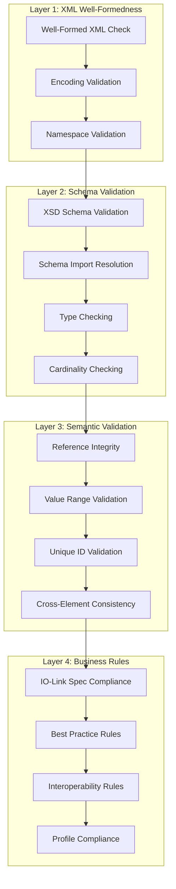
```mermaid
flowchart TB
    subgraph "Layer 1: XML Well-Formedness"
        WF[Well-Formed XML Check]
        Encoding[Encoding Validation]
        Namespace[Namespace Validation]
    end
    
    subgraph "Layer 2: Schema Validation"
        XSD[XSD Schema Validation]
        SchemaImport[Schema Import Resolution]
        TypeCheck[Type Checking]
        CardCheck[Cardinality Checking]
    end
    
    subgraph "Layer 3: Semantic Validation"
        RefIntegrity[Reference Integrity]
        ValueRange[Value Range Validation]
        UniqueID[Unique ID Validation]
        Consistency[Cross-Element Consistency]
    end
    
    subgraph "Layer 4: Business Rules"
        IOLinkSpec[IO-Link Spec Compliance]
        BestPractice[Best Practice Rules]
        Interop[Interoperability Rules]
        Profile[Profile Compliance]
    end
    
    WF --> Encoding --> Namespace
    Namespace --> XSD --> SchemaImport --> TypeCheck --> CardCheck
    CardCheck --> RefIntegrity --> ValueRange --> UniqueID --> Consistency
    Consistency --> IOLinkSpec --> BestPractice --> Interop --> Profile
```

### 8.2 Schema Validation Implementation

The IODD XSD schemas are modular:

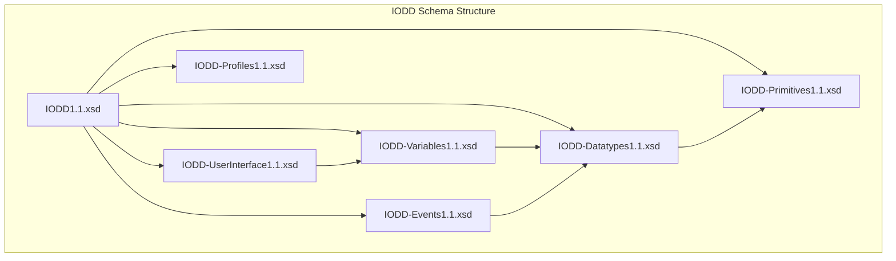
```mermaid
flowchart TB
    subgraph "IODD Schema Structure"
        Main[IODD1.1.xsd]
        
        Main --> Primitives[IODD-Primitives1.1.xsd]
        Main --> Datatypes[IODD-Datatypes1.1.xsd]
        Main --> Variables[IODD-Variables1.1.xsd]
        Main --> Events[IODD-Events1.1.xsd]
        Main --> UI[IODD-UserInterface1.1.xsd]
        Main --> Profiles[IODD-Profiles1.1.xsd]
        
        Datatypes --> Primitives
        Variables --> Datatypes
        Events --> Datatypes
        UI --> Variables
    end
```

### 8.3 Semantic Validation Rules

Rules that cannot be expressed in XSD but must be validated:

| Rule ID | Description | Severity |
|---------|-------------|----------|
| SEM-001 | All textId references must resolve to existing text definitions | Error |
| SEM-002 | Variable index values must be within valid ISDU range (0x0000-0xFFFF) | Error |
| SEM-003 | Process data bit lengths must not exceed device capabilities | Error |
| SEM-004 | StdVariableRef must reference valid standard definitions | Error |
| SEM-005 | RecordItem bitOffset + bitLength must not exceed parent bitLength | Error |
| SEM-006 | Menu references must form acyclic graph | Error |
| SEM-007 | Event codes must be unique within EventCollection | Error |
| SEM-008 | DeviceVariant productId should be globally unique | Warning |
| SEM-009 | VendorId must be IO-Link Consortium assigned | Warning |
| SEM-010 | Communication timing values must be within IO-Link spec limits | Error |

### 8.4 Rule Engine Architecture

```mermaid
classDiagram
    class ValidationRule {
        <<interface>>
        +id: str
        +description: str
        +severity: Severity
        +validate(context: ValidationContext): List~Violation~
    }
    
    class RuleEngine {
        -rules: List~ValidationRule~
        +registerRule(rule: ValidationRule): void
        +unregisterRule(ruleId: str): void
        +validate(document: IODDDocument): ValidationResult
        +validateWithRuleSet(document: IODDDocument, ruleSet: RuleSet): ValidationResult
    }
    
    class ValidationContext {
        +document: IODDDocument
        +currentElement: Any
        +xpath: str
        +standardDefinitions: StdDefinitions
        +resolvedTexts: Dict
    }
    
    class Violation {
        +ruleId: str
        +severity: Severity
        +message: str
        +location: Location
        +suggestion: Optional~str~
    }
    
    class RuleSet {
        +name: str
        +rules: List~str~
        +enabled: bool
    }
    
    class SchemaRule {
        +xsdPath: str
    }
    
    class SemanticRule {
        +xpath: str
        +condition: Expression
    }
    
    class SchematronRule {
        +pattern: str
        +assertions: List~Assertion~
    }
    
    ValidationRule <|.. SchemaRule
    ValidationRule <|.. SemanticRule
    ValidationRule <|.. SchematronRule
    
    RuleEngine --> ValidationRule
    RuleEngine --> RuleSet
    ValidationRule --> Violation
    ValidationRule --> ValidationContext
```

### 8.5 Custom Rule Definition (Schematron-style)

```xml
<!-- Example custom validation rule definition -->
<ValidationRule id="CUSTOM-001" severity="warning">
    <description>Device should provide manufacturer logo</description>
    <context>//DeviceIdentity</context>
    <assert test="VendorLogo">
        DeviceIdentity should include a VendorLogo element for better 
        visual identification in engineering tools.
    </assert>
    <suggest>
        Add VendorLogo element: &lt;VendorLogo name="vendor_logo.png"/&gt;
    </suggest>
</ValidationRule>
```

---

## 9. Quality Analysis Framework

### 9.1 Quality Dimensions

```mermaid
mindmap
    root((IODD Quality<br/>Assessment))
        Completeness
            Required Elements
            Optional Elements
            Localization Coverage
            Image Assets
        Correctness
            Schema Compliance
            Semantic Validity
            Value Accuracy
        Consistency
            Internal Consistency
            Cross-Reference Integrity
            Naming Conventions
        Usability
            Text Quality
            Menu Organization
            Documentation
        Interoperability
            Version Compliance
            Standard Definitions Usage
            Profile Compliance
        Maintainability
            Structure Organization
            ID Patterns
            Update History
```

### 9.2 Completeness Scoring

```python
# Pseudocode for completeness analysis

class CompletenessAnalyzer:
    
    REQUIRED_ELEMENTS = {
        'DeviceIdentity': {
            'vendorId': 10,
            'vendorName': 10,
            'deviceId': 10,
            'DeviceVariantCollection': 10,
        },
        'DeviceFunction': {
            'Features': 8,
            'VariableCollection': 10,
            'ProcessDataCollection': 10,
        },
        'CommNetworkProfile': 10,
    }
    
    RECOMMENDED_ELEMENTS = {
        'DeviceIdentity': {
            'VendorText': 5,
            'VendorUrl': 3,
            'VendorLogo': 4,
            'DeviceName': 5,
            'DeviceFamily': 3,
            'DeviceIcon': 4,
            'DeviceSymbol': 3,
        },
        'DeviceFunction': {
            'EventCollection': 5,
            'ErrorTypeCollection': 4,
            'UserInterface': 6,
        },
        'Localization': {
            'MultiLanguage': 5,
            'TextQuality': 4,
        }
    }
    
    def analyze(self, document: IODDDocument) -> CompletenessReport:
        required_score = self._check_required(document)
        recommended_score = self._check_recommended(document)
        
        total_possible = sum(self._flatten_scores(self.REQUIRED_ELEMENTS)) + \
                        sum(self._flatten_scores(self.RECOMMENDED_ELEMENTS))
        actual_score = required_score + recommended_score
        
        return CompletenessReport(
            score=actual_score / total_possible * 100,
            required_coverage=required_score,
            recommended_coverage=recommended_score,
            missing_required=self._find_missing_required(document),
            missing_recommended=self._find_missing_recommended(document),
        )
```

### 9.3 Best Practice Checks

| Check ID | Category | Description | Weight |
|----------|----------|-------------|--------|
| BP-001 | Naming | Variable IDs follow V_* convention | Medium |
| BP-002 | Naming | Menu IDs follow M_* convention | Medium |
| BP-003 | Naming | ProcessData IDs follow P_* convention | Medium |
| BP-004 | Documentation | All variables have descriptions | High |
| BP-005 | Documentation | All menu items have help text | Medium |
| BP-006 | Localization | Primary language is English | High |
| BP-007 | Localization | At least 2 languages supported | Medium |
| BP-008 | Structure | Observer menu provides essential info | High |
| BP-009 | Structure | Maintenance menu includes diagnostics | Medium |
| BP-010 | Process Data | Units specified for numeric values | High |
| BP-011 | Events | Standard events properly referenced | High |
| BP-012 | Images | Device icon provided | Medium |
| BP-013 | Images | Images meet size requirements | Low |

### 9.4 Anomaly Detection

```mermaid
flowchart TB
    subgraph "Anomaly Detection Pipeline"
        Input[IODD Document]
        
        subgraph "Statistical Analysis"
            BitLen[Unusual Bit Lengths]
            ValueRange[Extreme Value Ranges]
            TextLen[Abnormal Text Lengths]
        end
        
        subgraph "Pattern Analysis"
            DupPattern[Duplicate Patterns]
            RefCircle[Circular References]
            UnusedDef[Unused Definitions]
        end
        
        subgraph "Comparison Analysis"
            VendorComp[Compare to Vendor Norms]
            CategoryComp[Compare to Device Category]
            VersionComp[Compare to Previous Versions]
        end
        
        subgraph "Output"
            Anomalies[Detected Anomalies]
            Confidence[Confidence Scores]
            Explain[Explanations]
        end
    end
    
    Input --> BitLen & ValueRange & TextLen
    Input --> DupPattern & RefCircle & UnusedDef
    Input --> VendorComp & CategoryComp & VersionComp
    
    BitLen & ValueRange & TextLen --> Anomalies
    DupPattern & RefCircle & UnusedDef --> Anomalies
    VendorComp & CategoryComp & VersionComp --> Anomalies
    
    Anomalies --> Confidence --> Explain
```

### 9.5 Quality Report Structure

```json
{
  "overallScore": 87.5,
  "grade": "B+",
  "summary": {
    "status": "GOOD",
    "criticalIssues": 0,
    "warnings": 3,
    "suggestions": 12
  },
  "completeness": {
    "score": 92.0,
    "required": {
      "score": 100.0,
      "missing": []
    },
    "recommended": {
      "score": 84.0,
      "missing": ["VendorLogo", "DeviceIcon", "SecondLanguage"]
    }
  },
  "validation": {
    "schemaValid": true,
    "semanticValid": true,
    "errors": [],
    "warnings": [
      {
        "code": "SEM-008",
        "message": "ProductId format could improve uniqueness",
        "location": "/IODevice/ProfileBody/DeviceIdentity/DeviceVariantCollection/DeviceVariant/@productId"
      }
    ]
  },
  "bestPractices": {
    "score": 78.0,
    "passed": ["BP-001", "BP-002", "BP-006", "BP-011"],
    "failed": ["BP-004", "BP-012"],
    "notApplicable": ["BP-013"]
  },
  "anomalies": {
    "detected": 1,
    "items": [
      {
        "type": "UNUSUAL_BIT_LENGTH",
        "location": "/IODevice/ProfileBody/DeviceFunction/VariableCollection/Variable[@id='V_Custom']/Datatype",
        "description": "Bit length 37 is unusual for integer type",
        "confidence": 0.72
      }
    ]
  },
  "recommendations": [
    {
      "priority": "HIGH",
      "category": "Documentation",
      "message": "Add descriptions to all variables for better usability",
      "affectedElements": 5
    },
    {
      "priority": "MEDIUM",
      "category": "Localization",
      "message": "Consider adding German localization for European market",
      "affectedElements": 1
    }
  ]
}
```

---

## 10. Schema Management

### 10.1 Schema Registry

```mermaid
flowchart TB
    subgraph "Schema Registry"
        Registry[Schema Registry]
        
        subgraph "IODD V1.0.1 Schemas"
            V10_Main[IODD1.0.1.xsd]
            V10_Sub[Sub-schemas]
            V10_Std[StandardDefinitions V1.0.1]
        end
        
        subgraph "IODD V1.1 Schemas"
            V11_Main[IODD1.1.xsd]
            V11_Primitives[Primitives]
            V11_Datatypes[Datatypes]
            V11_Variables[Variables]
            V11_Events[Events]
            V11_UI[UserInterface]
            V11_Profiles[Profiles]
            V11_Std[StandardDefinitions V1.1]
        end
        
        subgraph "IODD V1.1.4 Schemas"
            V114_Main[IODD1.1.4.xsd]
            V114_Profiles[Common Profiles]
            V114_Std[StandardDefinitions V1.1.4]
        end
    end
    
    subgraph "Management Operations"
        Load[Load Schemas]
        Cache[Cache Compiled]
        Update[Update Check]
        Resolve[Resolve Imports]
    end
    
    Registry --> Load & Cache & Update & Resolve
    Load --> V10_Main & V11_Main & V114_Main
```

### 10.2 Schema Version Detection

```python
# Pseudocode for automatic version detection

class SchemaVersionDetector:
    
    VERSION_INDICATORS = {
        'http://www.io-link.com/IODD/2009/11': 'V1.0',
        'http://www.io-link.com/IODD/2010/10': 'V1.1',
    }
    
    PROFILE_REVISION_MAP = {
        '1.0': 'V1.0.1',
        '1.1': 'V1.1',
        '1.1.2': 'V1.1.2',
        '1.1.3': 'V1.1.3', 
        '1.1.4': 'V1.1.4',
    }
    
    def detect_version(self, xml_doc) -> IODDVersion:
        # Check namespace
        namespace = xml_doc.root.get('xmlns')
        base_version = self.VERSION_INDICATORS.get(namespace)
        
        # Refine with ProfileRevision
        profile_revision = xml_doc.find('//ProfileHeader/ProfileRevision')
        if profile_revision is not None:
            refined = self.PROFILE_REVISION_MAP.get(profile_revision.text)
            if refined:
                return IODDVersion(refined)
        
        # Check schema location for additional hints
        schema_location = xml_doc.root.get(
            '{http://www.w3.org/2001/XMLSchema-instance}schemaLocation'
        )
        if schema_location and 'IODD1.1' in schema_location:
            return IODDVersion('V1.1')
        
        return IODDVersion(base_version or 'UNKNOWN')
```

### 10.3 Standard Definitions Management

```mermaid
flowchart LR
    subgraph "Standard Definitions Loading"
        StdDef[IODD-StandardDefinitions.xml]
        
        StdDef --> StdVars[Standard Variables]
        StdDef --> StdEvents[Standard Events]
        StdDef --> StdErrors[Standard Errors]
        StdDef --> StdCmds[System Commands]
        StdDef --> StdTypes[Standard Types]
    end
    
    subgraph "Resolution Process"
        IODDDoc[IODD Document]
        
        IODDDoc --> RefStdVar[StdVariableRef]
        IODDDoc --> RefStdEvent[Std Event Codes]
        IODDDoc --> RefStdError[Std Error Refs]
    end
    
    subgraph "Merged Model"
        Merged[Complete IODD Model]
    end
    
    StdVars --> |resolves| RefStdVar
    StdEvents --> |resolves| RefStdEvent
    StdErrors --> |resolves| RefStdError
    
    RefStdVar & RefStdEvent & RefStdError --> Merged
```

---

## 11. Integration Capabilities

### 11.1 IODDfinder API Integration

```mermaid
sequenceDiagram
    participant App as Application
    participant Parser as IODD Parser
    participant Cache as Local Cache
    participant API as IODDfinder API
    
    App->>Parser: requestIODD(vendorId, deviceId)
    Parser->>Cache: checkCache(vendorId, deviceId)
    
    alt Cache Hit
        Cache-->>Parser: CachedIODD
        Parser-->>App: IODDDocument
    else Cache Miss
        Parser->>API: GET /productvariants/search/{vendorId}/{deviceId}
        API-->>Parser: ProductVariantList
        
        Parser->>API: GET /iodd/download/{productVariantId}
        API-->>Parser: IODD ZIP Package
        
        Parser->>Cache: store(ioddPackage)
        Parser->>Parser: parse(ioddPackage)
        Parser-->>App: IODDDocument
    end
```

### 11.2 Export Formats

```mermaid
flowchart TB
    IODDDoc[Parsed IODD Document]
    
    subgraph "Export Plugins"
        JSON[JSON Exporter]
        OPCUA[OPC UA Mapper]
        Code[Code Generator]
        Report[Report Generator]
        Custom[Custom Exporter]
    end
    
    subgraph "JSON Outputs"
        FullJSON[Full JSON Export]
        CompactJSON[Compact JSON]
        SchemaJSON[JSON Schema]
    end
    
    subgraph "OPC UA Outputs"
        NodeSet[NodeSet2.xml]
        TypeDef[Type Definitions]
        Instance[Instance Model]
    end
    
    subgraph "Code Outputs"
        CSharp[C# Classes]
        Python[Python Dataclasses]
        TypeScript[TypeScript Interfaces]
        Rust[Rust Structs]
    end
    
    subgraph "Report Outputs"
        HTML[HTML Report]
        PDF[PDF Report]
        Markdown[Markdown Doc]
    end
    
    IODDDoc --> JSON --> FullJSON & CompactJSON & SchemaJSON
    IODDDoc --> OPCUA --> NodeSet & TypeDef & Instance
    IODDDoc --> Code --> CSharp & Python & TypeScript & Rust
    IODDDoc --> Report --> HTML & PDF & Markdown
    IODDDoc --> Custom
```

### 11.3 OPC UA Mapping

Following the OPC UA for IO-Link specification:

```mermaid
flowchart TB
    subgraph "IODD Elements"
        DI[DeviceIdentity]
        DF[DeviceFunction]
        Vars[VariableCollection]
        PD[ProcessDataCollection]
        Menu[UserInterface/Menus]
    end
    
    subgraph "OPC UA Mapping"
        DevType[IOLinkIODDDeviceType]
        ParamSet[ParameterSet Object]
        PDVars[ProcessData Variables]
        FuncGroups[FunctionalGroups]
        
        DevType --> ParamSet
        DevType --> PDVars
        DevType --> FuncGroups
    end
    
    subgraph "Resulting NodeSet"
        TypeNode[ObjectType Node]
        InstanceDecl[InstanceDeclarations]
        Properties[Property Nodes]
        Variables[Variable Nodes]
    end
    
    DI --> |maps to| DevType
    Vars --> |creates| ParamSet
    PD --> |creates| PDVars
    Menu --> |creates| FuncGroups
    
    DevType --> TypeNode
    ParamSet & PDVars & FuncGroups --> InstanceDecl
    InstanceDecl --> Properties & Variables
```

### 11.4 REST API Design

```yaml
openapi: 3.0.0
info:
  title: IODD Parser API
  version: 1.0.0

paths:
  /parse:
    post:
      summary: Parse IODD from uploaded file
      requestBody:
        content:
          multipart/form-data:
            schema:
              type: object
              properties:
                file:
                  type: string
                  format: binary
                options:
                  $ref: '#/components/schemas/ParseOptions'
      responses:
        200:
          description: Successful parse
          content:
            application/json:
              schema:
                $ref: '#/components/schemas/ParseResult'
  
  /validate:
    post:
      summary: Validate IODD without full parsing
      requestBody:
        content:
          multipart/form-data:
            schema:
              type: object
              properties:
                file:
                  type: string
                  format: binary
                ruleSet:
                  type: string
      responses:
        200:
          description: Validation result
          content:
            application/json:
              schema:
                $ref: '#/components/schemas/ValidationResult'
  
  /analyze:
    post:
      summary: Perform quality analysis
      requestBody:
        content:
          application/json:
            schema:
              $ref: '#/components/schemas/AnalyzeRequest'
      responses:
        200:
          description: Quality report
          content:
            application/json:
              schema:
                $ref: '#/components/schemas/QualityReport'
  
  /fetch/{vendorId}/{deviceId}:
    get:
      summary: Fetch and parse IODD from IODDfinder
      parameters:
        - name: vendorId
          in: path
          required: true
          schema:
            type: integer
        - name: deviceId
          in: path
          required: true
          schema:
            type: integer
      responses:
        200:
          description: Parsed IODD
          content:
            application/json:
              schema:
                $ref: '#/components/schemas/IODDDocument'

  /export/{format}:
    post:
      summary: Export parsed IODD to specified format
      parameters:
        - name: format
          in: path
          required: true
          schema:
            type: string
            enum: [json, opcua, csharp, python, typescript]
      requestBody:
        content:
          application/json:
            schema:
              $ref: '#/components/schemas/ExportRequest'
      responses:
        200:
          description: Exported content
```

---

## 12. Testing Strategy

### 12.1 Test Pyramid

```mermaid
flowchart TB
    subgraph "Test Pyramid"
        E2E[End-to-End Tests<br/>~50 tests]
        Integration[Integration Tests<br/>~200 tests]
        Unit[Unit Tests<br/>~1000+ tests]
    end
    
    subgraph "E2E Coverage"
        E1[Full Parse Pipeline]
        E2[API Endpoints]
        E3[Export Workflows]
    end
    
    subgraph "Integration Coverage"
        I1[Parser + Validator]
        I2[Validator + RuleEngine]
        I3[Parser + Exporter]
        I4[IODDfinder Integration]
    end
    
    subgraph "Unit Coverage"
        U1[Data Type Parsing]
        U2[XML Navigation]
        U3[Reference Resolution]
        U4[Individual Rules]
        U5[Export Formatters]
    end
    
    E2E --> E1 & E2 & E3
    Integration --> I1 & I2 & I3 & I4
    Unit --> U1 & U2 & U3 & U4 & U5
```

### 12.2 Test Data Strategy

```mermaid
flowchart LR
    subgraph "Test IODD Sources"
        Official[Official IO-Link Examples]
        Vendor[Real Vendor IODDs]
        Synthetic[Synthetic Test Cases]
        Malformed[Intentionally Malformed]
    end
    
    subgraph "Test Categories"
        Valid[Valid IODDs<br/>All versions]
        Edge[Edge Cases<br/>Boundary values]
        Error[Error Cases<br/>Validation failures]
        Perf[Performance Cases<br/>Large IODDs]
    end
    
    Official --> Valid
    Vendor --> Valid & Edge
    Synthetic --> Edge & Error & Perf
    Malformed --> Error
```

### 12.3 Regression Test Suite

| Test Category | Count | Coverage Target |
|---------------|-------|-----------------|
| Schema Validation | 150+ | All XSD rules |
| Semantic Validation | 100+ | All semantic rules |
| Data Type Parsing | 200+ | All type combinations |
| Process Data | 75+ | All PD structures |
| Reference Resolution | 50+ | All ref types |
| Version Compatibility | 40+ | All IODD versions |
| Error Handling | 100+ | All error paths |
| Export Formats | 80+ | All export types |
| Performance | 20+ | Size/complexity matrix |

### 12.4 Continuous Integration

```mermaid
flowchart LR
    subgraph "CI Pipeline"
        Commit[Code Commit]
        Lint[Linting]
        Unit[Unit Tests]
        Integration[Integration Tests]
        Quality[Code Quality]
        Security[Security Scan]
        Build[Build Artifacts]
        E2E[E2E Tests]
        Deploy[Deploy Preview]
    end
    
    Commit --> Lint --> Unit --> Integration
    Integration --> Quality --> Security --> Build
    Build --> E2E --> Deploy
    
    subgraph "Quality Gates"
        Coverage[>90% Coverage]
        NoFail[0 Test Failures]
        NoVuln[0 High Vulnerabilities]
        Perf[<5s Parse Time]
    end
    
    Unit --> Coverage
    Integration --> NoFail
    Security --> NoVuln
    E2E --> Perf
```

---

## 13. Performance Optimization

### 13.1 Parsing Performance Targets

| IODD Size | Parse Target | Validate Target | Full Analysis Target |
|-----------|--------------|-----------------|---------------------|
| Small (<50KB) | <100ms | <200ms | <500ms |
| Medium (50-200KB) | <500ms | <1s | <2s |
| Large (>200KB) | <2s | <3s | <5s |

### 13.2 Optimization Strategies

```mermaid
flowchart TB
    subgraph "Parsing Optimizations"
        Lazy[Lazy Loading]
        Stream[Streaming Parser]
        Cache[Schema Caching]
        Parallel[Parallel Validation]
    end
    
    subgraph "Memory Optimizations"
        Pool[Object Pooling]
        Flyweight[Flyweight Patterns]
        WeakRef[Weak References for Cache]
        GC[Explicit GC Hints]
    end
    
    subgraph "I/O Optimizations"
        BufferedIO[Buffered I/O]
        AsyncLoad[Async Loading]
        Compress[Compression Handling]
        MemMap[Memory Mapping]
    end
    
    subgraph "Result"
        Fast[Fast Parse Times]
        LowMem[Low Memory Usage]
        Scalable[Scalable Architecture]
    end
    
    Lazy & Stream & Cache & Parallel --> Fast
    Pool & Flyweight & WeakRef & GC --> LowMem
    BufferedIO & AsyncLoad & Compress & MemMap --> Scalable
```

### 13.3 Caching Strategy

```mermaid
flowchart TB
    subgraph "Cache Layers"
        L1[L1: Compiled Schemas<br/>In-Memory]
        L2[L2: Parsed IODDs<br/>LRU Cache]
        L3[L3: Validation Results<br/>Content-Addressed]
        L4[L4: IODD Packages<br/>Disk Cache]
    end
    
    subgraph "Cache Keys"
        SchemaKey[Version + Namespace]
        IODDKey[Hash of XML Content]
        ValKey[IODD Hash + Rule Version]
        PkgKey[Vendor + Device + Version]
    end
    
    L1 --> SchemaKey
    L2 --> IODDKey
    L3 --> ValKey
    L4 --> PkgKey
    
    subgraph "Invalidation"
        SchemaInv[On Schema Update]
        IODDInv[On Memory Pressure]
        ValInv[On Rule Changes]
        PkgInv[On TTL Expiry]
    end
    
    SchemaKey --> SchemaInv
    IODDKey --> IODDInv
    ValKey --> ValInv
    PkgKey --> PkgInv
```

---

## 14. Continuous Improvement Framework

### 14.1 Improvement Lifecycle

```mermaid
flowchart TB
    subgraph "Input Sources"
        UserFeedback[User Feedback]
        BugReports[Bug Reports]
        NewSpecs[New Specifications]
        FieldData[Field Usage Data]
    end
    
    subgraph "Analysis"
        Triage[Issue Triage]
        Impact[Impact Analysis]
        Design[Design Review]
    end
    
    subgraph "Implementation"
        Dev[Development]
        Test[Testing]
        Review[Code Review]
    end
    
    subgraph "Release"
        Stage[Staging]
        Validate[Validation]
        Deploy[Deployment]
        Doc[Documentation]
    end
    
    subgraph "Feedback"
        Monitor[Monitoring]
        Metrics[Metrics Collection]
        Learn[Learning]
    end
    
    UserFeedback & BugReports & NewSpecs & FieldData --> Triage
    Triage --> Impact --> Design
    Design --> Dev --> Test --> Review
    Review --> Stage --> Validate --> Deploy --> Doc
    Doc --> Monitor --> Metrics --> Learn
    Learn --> Triage
```

### 14.2 Extensibility Points

| Extension Type | Purpose | Interface |
|----------------|---------|-----------|
| Custom Validator | Add domain-specific validation | `IValidator` |
| Custom Analyzer | Add quality analysis logic | `IAnalyzer` |
| Custom Exporter | Add new export format | `IExporter` |
| Custom Resolver | Add new reference resolution | `IResolver` |
| Custom Parser | Add support for related formats | `IParser` |
| Event Listener | React to parsing events | `IEventListener` |

### 14.3 Versioning Strategy

```mermaid
gitGraph
    commit id: "v1.0.0"
    branch develop
    commit id: "feature/opcua-export"
    commit id: "feature/quality-analyzer"
    checkout main
    merge develop id: "v1.1.0"
    branch hotfix
    commit id: "fix/schema-validation"
    checkout main
    merge hotfix id: "v1.1.1"
    checkout develop
    commit id: "feature/v1.1.4-support"
    commit id: "feature/performance-opt"
    checkout main
    merge develop id: "v1.2.0"
```

### 14.4 Roadmap

```mermaid
timeline
    title IODD Parser Development Roadmap
    
    section Phase 1 - Foundation
        Q1 2025 : Core Parser
                : Schema Validation
                : Basic Data Types
        Q2 2025 : Semantic Validation
                : Reference Resolution
                : Error Handling
    
    section Phase 2 - Quality
        Q3 2025 : Quality Analyzer
                : Best Practice Checks
                : Completeness Scoring
        Q4 2025 : Anomaly Detection
                : Reporting Engine
                : JSON Export
    
    section Phase 3 - Integration
        Q1 2026 : IODDfinder API
                : OPC UA Export
                : REST API
        Q2 2026 : Code Generation
                : Plugin System
                : CI/CD Integration
    
    section Phase 4 - Advanced
        Q3 2026 : Profile Support
                : Performance Optimization
                : Advanced Analytics
        Q4 2026 : Enterprise Features
                : Cloud Deployment
                : ML-based Analysis
```

---

## 15. Reference Appendix

### 15.1 Official IO-Link Resources

| Resource | URL | Description |
|----------|-----|-------------|
| IO-Link Community | https://io-link.com | Official IO-Link organization |
| IODD Specification Download | https://io-link.com/downloads | Specifications and schemas |
| IODDfinder | https://ioddfinder.io-link.com | Central IODD repository |
| IODD Checker | Available via io-link.com | Official validation tool |
| IODD Viewer | Available via io-link.com | IODD visualization tool |

### 15.2 Specification Documents

| Document | Version | Description |
|----------|---------|-------------|
| IO Device Description Specification | V1.1.4 (2024) | Main IODD specification |
| IO Device Description Guideline | V1.1.4 (2024) | Implementation guidance with examples |
| IO-Link Interface and System Specification | V1.1.4 (2024) | Core IO-Link protocol specification |
| IO-Link Test Specification | V1.1.4 (2024) | Conformance testing requirements |
| OPC UA for IO-Link | V1.0 (2018) | OPC UA information model mapping |

### 15.3 Related Standards

| Standard | Description | Relevance |
|----------|-------------|-----------|
| ISO 15745 | Industrial automation systems integration framework | IODD structure basis |
| IEC 61131-9 | Single-drop digital communication interface (IO-Link) | IO-Link specification |
| ISO/IEC 8859-1 | Latin-1 character encoding | Text encoding default |
| UTF-8 (RFC 3629) | Unicode encoding | Text encoding standard |
| XML Schema 1.0 | W3C XML Schema Definition | IODD validation |

### 15.4 Data Type Reference

| IODD Type | Bit Range | Equivalent Types |
|-----------|-----------|------------------|
| BooleanT | 1 | bool, boolean |
| IntegerT | 1-64 | int8-int64, signed |
| UIntegerT | 1-64 | uint8-uint64, unsigned |
| Float32T | 32 | float, single |
| StringT | 8*n | string, char[] |
| OctetStringT | 8*n | byte[], bytes |
| RecordT | variable | struct, record |
| ArrayT | variable | array, list |

### 15.5 Index/Subindex Reference

| Range | Category | Examples |
|-------|----------|----------|
| 0x0000 | Direct Parameters | Page 1 & 2 access |
| 0x0001 | System Command | Device/App reset |
| 0x0002-0x000B | Reserved | - |
| 0x000C | Device Access Locks | Parameter/DS locks |
| 0x000D | Profile Characteristic | Profile support |
| 0x0010-0x0018 | Identification | Vendor, Product, Serial |
| 0x0019-0x001F | Reserved | - |
| 0x0020-0x002F | Diagnosis | Events, status |
| 0x0030-0x005F | Reserved | - |
| 0x0060-0x00FF | Application Specific | Vendor parameters |
| 0x0100-0x7FFF | Application Specific | Extended parameters |
| 0x8000-0xFFFF | Reserved | Future use |

### 15.6 Event Code Reference

| Range | Category | Description |
|-------|----------|-------------|
| 0x0000 | Reserved | - |
| 0x0001-0x00FF | Standard Events | IO-Link defined |
| 0x1000-0x17FF | Diagnosis | Device diagnostics |
| 0x1800-0x1FFF | Notification | Information events |
| 0x2000-0x27FF | Warning | Warning conditions |
| 0x2800-0x2FFF | Warning - Diagnosis | Diagnostic warnings |
| 0x3000-0x37FF | Error | Error conditions |
| 0x3800-0x3FFF | Error - Diagnosis | Diagnostic errors |
| 0x4000-0x5FFF | Reserved | - |
| 0x6000-0x6FFF | Vendor Specific | Manufacturer events |
| 0x7000-0xFFFF | Reserved | - |

### 15.7 Vendor ID Registry (Selected)

| Vendor ID | Vendor Name |
|-----------|-------------|
| 0 | IO-Link Community |
| 310 | ifm electronic |
| 42 | SICK AG |
| 273 | Balluff |
| 287 | Turck |
| 402 | Pepperl+Fuchs |
| 283 | Festo |
| 304 | Banner Engineering |
| 256 | Siemens |
| 305 | Beckhoff |

### 15.8 Glossary

| Term | Definition |
|------|------------|
| IODD | IO Device Description - XML-based device descriptor |
| IO-Link | IEC 61131-9 standardized point-to-point communication |
| ISDU | Indexed Service Data Unit - acyclic data access |
| PDI | Process Data In - cyclic input data |
| PDO | Process Data Out - cyclic output data |
| SMI | Standard Master Interface - master API |
| DSP | Data Storage Parameter - backup/restore |
| OD | On-request Data - acyclic parameters |
| PD | Process Data - cyclic I/O |

### 15.9 Bibliography

1. Uffelmann, J.R., Wienzek, P., Jahn, M. (2018). *IO-Link: The DNA of Industry 4.0*. Vulkan-Verlag GmbH.

2. IO-Link Community. (2024). *IO Device Description Specification V1.1.4*.

3. IO-Link Community. (2024). *IO-Link Interface and System Specification V1.1.4*.

4. OPC Foundation & IO-Link Community. (2018). *OPC UA for IO-Link Devices and Masters*.

5. ISO 15745-1:2003. *Industrial automation systems and integration — Open systems application integration framework*.

6. IEC 61131-9:2022. *Programmable controllers — Part 9: Single-drop digital communication interface for small sensors and actuators (SDCI)*.

---

## Document Information

**Authors**: Generated Technical Specification  
**Review Status**: Draft for Technical Review  
**Classification**: Public Technical Documentation  
**License**: Documentation released under CC BY 4.0

---

*This document represents a comprehensive technical specification for building an enterprise-grade IODD parser. Implementation should follow the modular architecture defined herein, with continuous improvement based on field experience and specification updates from the IO-Link Community.*
