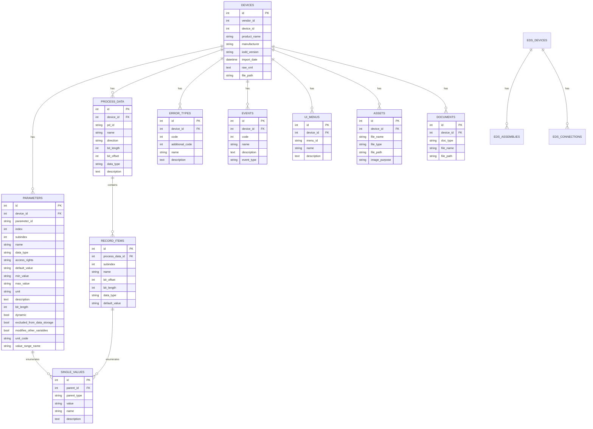

# GreenStack Database Schema

**Version**: 1.0.0
**Last Updated**: January 2025
**Database**: SQLite (development), PostgreSQL (production)

## Table of Contents

- [Overview](#overview)
- [Entity Relationship Diagram](#entity-relationship-diagram)
- [IODD Schema](#iodd-schema)
- [EDS Schema](#eds-schema)
- [Support System Schema](#support-system-schema)
- [Indexes](#indexes)
- [Migrations](#migrations)

---

## Overview

GreenStack uses a relational database to store device profiles, parameters, process data, and related metadata extracted from IODD and EDS files.

### Database Technologies

- **Development**: SQLite 3.x
- **Production**: PostgreSQL 13+
- **ORM**: SQLAlchemy 2.0
- **Migrations**: Alembic

### Design Principles

- **Normalized Design**: Minimize data redundancy
- **Foreign Keys**: Enforce referential integrity
- **Indexes**: Optimize common queries
- **Versioning**: Support schema evolution via migrations

---

## Entity Relationship Diagram



---

## IODD Schema

### `devices` Table

Stores core device information from IODD files.

```sql
CREATE TABLE devices (
    id INTEGER PRIMARY KEY AUTOINCREMENT,
    vendor_id INTEGER NOT NULL,
    device_id INTEGER NOT NULL,
    product_name TEXT NOT NULL,
    product_text TEXT,
    manufacturer TEXT NOT NULL,
    hardware_revision TEXT,
    firmware_revision TEXT,
    iodd_version TEXT NOT NULL,
    import_date TIMESTAMP DEFAULT CURRENT_TIMESTAMP,
    raw_xml TEXT,
    file_path TEXT,
    device_family TEXT,
    profile_charset TEXT,
    iolink_revision TEXT,
    min_cycle_time INTEGER,
    UNIQUE(vendor_id, device_id)
);
```

**Columns**:
- `id`: Auto-incrementing primary key
- `vendor_id`: IO-Link vendor ID (16-bit integer)
- `device_id`: Device ID within vendor namespace (24-bit integer)
- `product_name`: Human-readable product name
- `product_text`: Extended product description
- `manufacturer`: Vendor/manufacturer name
- `hardware_revision`: Hardware version string
- `firmware_revision`: Firmware version string
- `iodd_version`: IODD specification version (e.g., "1.1")
- `import_date`: Timestamp when device was imported
- `raw_xml`: Complete IODD XML content
- `file_path`: Path to original IODD file
- `device_family`: Product family classification
- `profile_charset`: Character encoding (typically "UTF-8")
- `iolink_revision`: IO-Link protocol revision
- `min_cycle_time`: Minimum cycle time in microseconds

**Constraints**:
- `UNIQUE(vendor_id, device_id)`: Prevent duplicate device imports

---

### `parameters` Table

Stores device parameters (configuration and monitoring variables).

```sql
CREATE TABLE parameters (
    id INTEGER PRIMARY KEY AUTOINCREMENT,
    device_id INTEGER NOT NULL,
    parameter_id TEXT,
    index INTEGER NOT NULL,
    subindex INTEGER DEFAULT 0,
    name TEXT NOT NULL,
    data_type TEXT NOT NULL,
    access_rights TEXT NOT NULL,
    default_value TEXT,
    min_value TEXT,
    max_value TEXT,
    unit TEXT,
    description TEXT,
    bit_length INTEGER,
    dynamic BOOLEAN DEFAULT FALSE,
    excluded_from_data_storage BOOLEAN DEFAULT FALSE,
    modifies_other_variables BOOLEAN DEFAULT FALSE,
    unit_code TEXT,
    value_range_name TEXT,
    FOREIGN KEY (device_id) REFERENCES devices(id) ON DELETE CASCADE
);
```

**Columns**:
- `id`: Primary key
- `device_id`: Foreign key to `devices` table
- `parameter_id`: IODD parameter identifier (e.g., "V_Temp")
- `index`: Parameter index in device memory (0-65535)
- `subindex`: Sub-index for structured parameters (0-255)
- `name`: Human-readable parameter name
- `data_type`: Data type (e.g., "Float32T", "IntegerT", "OctetStringT")
- `access_rights`: Access mode ("ro", "wo", "rw")
- `default_value`: Default value as string
- `min_value`: Minimum allowed value
- `max_value`: Maximum allowed value
- `unit`: Physical unit (e.g., "°C", "bar", "rpm")
- `description`: Parameter description/help text
- `bit_length`: Size in bits
- `dynamic`: Whether parameter is dynamic (changes during runtime)
- `excluded_from_data_storage`: Whether to exclude from device data storage
- `modifies_other_variables`: Whether writing this parameter affects others
- `unit_code`: Standard unit code reference
- `value_range_name`: Reference to value range definition

**Access Rights Values**:
- `ro`: Read-only
- `wo`: Write-only
- `rw`: Read-write

---

### `process_data` Table

Stores process data (cyclically exchanged data between master and device).

```sql
CREATE TABLE process_data (
    id INTEGER PRIMARY KEY AUTOINCREMENT,
    device_id INTEGER NOT NULL,
    pd_id TEXT NOT NULL,
    name TEXT NOT NULL,
    direction TEXT NOT NULL,
    bit_length INTEGER NOT NULL,
    bit_offset INTEGER DEFAULT 0,
    data_type TEXT,
    description TEXT,
    FOREIGN KEY (device_id) REFERENCES devices(id) ON DELETE CASCADE
);
```

**Columns**:
- `id`: Primary key
- `device_id`: Foreign key to `devices` table
- `pd_id`: Process data identifier from IODD
- `name`: Process data name
- `direction`: "input" (device → master) or "output" (master → device)
- `bit_length`: Size in bits
- `bit_offset`: Offset within process data frame
- `data_type`: Data type of the process data
- `description`: Description of the process data

---

### `record_items` Table

Stores structured elements within process data records.

```sql
CREATE TABLE record_items (
    id INTEGER PRIMARY KEY AUTOINCREMENT,
    process_data_id INTEGER NOT NULL,
    subindex INTEGER NOT NULL,
    name TEXT NOT NULL,
    bit_offset INTEGER NOT NULL,
    bit_length INTEGER NOT NULL,
    data_type TEXT NOT NULL,
    default_value TEXT,
    FOREIGN KEY (process_data_id) REFERENCES process_data(id) ON DELETE CASCADE
);
```

**Columns**:
- `id`: Primary key
- `process_data_id`: Foreign key to `process_data` table
- `subindex`: Sub-index within record
- `name`: Record item name
- `bit_offset`: Bit offset within parent process data
- `bit_length`: Size in bits
- `data_type`: Data type
- `default_value`: Default value

---

### `single_values` Table

Stores enumeration values for parameters and record items.

```sql
CREATE TABLE single_values (
    id INTEGER PRIMARY KEY AUTOINCREMENT,
    parent_id INTEGER NOT NULL,
    parent_type TEXT NOT NULL,
    value TEXT NOT NULL,
    name TEXT NOT NULL,
    description TEXT,
    CHECK (parent_type IN ('parameter', 'record_item'))
);
```

**Columns**:
- `id`: Primary key
- `parent_id`: ID of parent parameter or record_item
- `parent_type`: "parameter" or "record_item"
- `value`: Numeric or string value
- `name`: Human-readable name for this value
- `description`: Description of what this value represents

**Example**:
For a "Status" parameter with enumerated values:
- `{parent_id: 123, parent_type: 'parameter', value: '0', name: 'OK', description: 'Normal operation'}`
- `{parent_id: 123, parent_type: 'parameter', value: '1', name: 'Warning', description: 'Warning condition'}`
- `{parent_id: 123, parent_type: 'parameter', value: '2', name: 'Error', description: 'Error state'}`

---

### `error_types` Table

Stores device error definitions.

```sql
CREATE TABLE error_types (
    id INTEGER PRIMARY KEY AUTOINCREMENT,
    device_id INTEGER NOT NULL,
    code INTEGER NOT NULL,
    additional_code INTEGER,
    name TEXT,
    description TEXT,
    FOREIGN KEY (device_id) REFERENCES devices(id) ON DELETE CASCADE
);
```

**Columns**:
- `id`: Primary key
- `device_id`: Foreign key to `devices` table
- `code`: Primary error code
- `additional_code`: Additional error code for specificity
- `name`: Error name
- `description`: Error description/troubleshooting info

---

### `events` Table

Stores device event definitions.

```sql
CREATE TABLE events (
    id INTEGER PRIMARY KEY AUTOINCREMENT,
    device_id INTEGER NOT NULL,
    code INTEGER NOT NULL,
    name TEXT,
    description TEXT,
    event_type TEXT,
    FOREIGN KEY (device_id) REFERENCES devices(id) ON DELETE CASCADE
);
```

**Columns**:
- `id`: Primary key
- `device_id`: Foreign key to `devices` table
- `code`: Event code
- `name`: Event name
- `description`: Event description
- `event_type`: Event category (e.g., "notification", "warning")

---

### `ui_menus` Table

Stores UI menu structure for device configuration interfaces.

```sql
CREATE TABLE ui_menus (
    id INTEGER PRIMARY KEY AUTOINCREMENT,
    device_id INTEGER NOT NULL,
    menu_id TEXT NOT NULL,
    name TEXT NOT NULL,
    description TEXT,
    FOREIGN KEY (device_id) REFERENCES devices(id) ON DELETE CASCADE
);
```

**Columns**:
- `id`: Primary key
- `device_id`: Foreign key to `devices` table
- `menu_id`: Menu identifier from IODD
- `name`: Menu display name
- `description`: Menu description

---

### `assets` Table

Stores device-related assets (images, icons, logos).

```sql
CREATE TABLE assets (
    id INTEGER PRIMARY KEY AUTOINCREMENT,
    device_id INTEGER NOT NULL,
    file_name TEXT NOT NULL,
    file_type TEXT NOT NULL,
    file_path TEXT,
    image_purpose TEXT,
    FOREIGN KEY (device_id) REFERENCES devices(id) ON DELETE CASCADE
);
```

**Columns**:
- `id`: Primary key
- `device_id`: Foreign key to `devices` table
- `file_name`: Original filename
- `file_type`: MIME type (e.g., "image/png", "image/svg+xml")
- `file_path`: Path to stored file
- `image_purpose`: Purpose category (e.g., "DeviceIcon", "ProductImage")

---

### `documents` Table

Stores device documentation files.

```sql
CREATE TABLE documents (
    id INTEGER PRIMARY KEY AUTOINCREMENT,
    device_id INTEGER NOT NULL,
    doc_type TEXT NOT NULL,
    file_name TEXT NOT NULL,
    file_path TEXT,
    FOREIGN KEY (device_id) REFERENCES devices(id) ON DELETE CASCADE
);
```

**Columns**:
- `id`: Primary key
- `device_id`: Foreign key to `devices` table
- `doc_type`: Document type (e.g., "manual", "datasheet", "certificate")
- `file_name`: Original filename
- `file_path`: Path to stored file

---

## EDS Schema

### `eds_devices` Table

Stores EtherNet/IP device information from EDS files.

```sql
CREATE TABLE eds_devices (
    id INTEGER PRIMARY KEY AUTOINCREMENT,
    vendor_id INTEGER NOT NULL,
    product_name TEXT NOT NULL,
    catalog_number TEXT,
    major_revision INTEGER,
    minor_revision INTEGER,
    description TEXT,
    import_date TIMESTAMP DEFAULT CURRENT_TIMESTAMP,
    raw_content TEXT,
    file_path TEXT,
    home_url TEXT
);
```

**Columns**:
- `id`: Primary key
- `vendor_id`: EtherNet/IP vendor ID
- `product_name`: Product name
- `catalog_number`: Catalog/part number
- `major_revision`: Major hardware/firmware revision
- `minor_revision`: Minor hardware/firmware revision
- `description`: Product description
- `import_date`: Import timestamp
- `raw_content`: Complete EDS file content
- `file_path`: Path to original EDS file
- `home_url`: Vendor website URL

---

### `eds_assemblies` Table

Stores assembly definitions for EDS devices.

```sql
CREATE TABLE eds_assemblies (
    id INTEGER PRIMARY KEY AUTOINCREMENT,
    eds_device_id INTEGER NOT NULL,
    assembly_id INTEGER NOT NULL,
    name TEXT,
    size INTEGER,
    description TEXT,
    FOREIGN KEY (eds_device_id) REFERENCES eds_devices(id) ON DELETE CASCADE
);
```

**Columns**:
- `id`: Primary key
- `eds_device_id`: Foreign key to `eds_devices` table
- `assembly_id`: Assembly instance number
- `name`: Assembly name
- `size`: Size in bytes
- `description`: Assembly description

---

### `eds_connections` Table

Stores connection configurations for EDS devices.

```sql
CREATE TABLE eds_connections (
    id INTEGER PRIMARY KEY AUTOINCREMENT,
    eds_device_id INTEGER NOT NULL,
    connection_type TEXT,
    input_size INTEGER,
    output_size INTEGER,
    config_size INTEGER,
    FOREIGN KEY (eds_device_id) REFERENCES eds_devices(id) ON DELETE CASCADE
);
```

**Columns**:
- `id`: Primary key
- `eds_device_id`: Foreign key to `eds_devices` table
- `connection_type`: Connection type (e.g., "Explicit", "Implicit")
- `input_size`: Input data size in bytes
- `output_size`: Output data size in bytes
- `config_size`: Configuration data size in bytes

---

## Support System Schema

### `tickets` Table

Stores support tickets and issues.

```sql
CREATE TABLE tickets (
    id INTEGER PRIMARY KEY AUTOINCREMENT,
    title TEXT NOT NULL,
    description TEXT,
    status TEXT NOT NULL DEFAULT 'open',
    priority TEXT DEFAULT 'medium',
    category TEXT,
    device_id INTEGER,
    created_at TIMESTAMP DEFAULT CURRENT_TIMESTAMP,
    updated_at TIMESTAMP DEFAULT CURRENT_TIMESTAMP,
    resolved_at TIMESTAMP,
    CHECK (status IN ('open', 'in_progress', 'resolved', 'closed')),
    CHECK (priority IN ('low', 'medium', 'high', 'critical')),
    FOREIGN KEY (device_id) REFERENCES devices(id) ON DELETE SET NULL
);
```

**Columns**:
- `id`: Primary key
- `title`: Ticket title/summary
- `description`: Detailed description
- `status`: Current status
- `priority`: Priority level
- `category`: Ticket category
- `device_id`: Optional reference to related device
- `created_at`: Creation timestamp
- `updated_at`: Last update timestamp
- `resolved_at`: Resolution timestamp

---

### `services_status` Table

Tracks external service status.

```sql
CREATE TABLE services_status (
    id INTEGER PRIMARY KEY AUTOINCREMENT,
    service_name TEXT UNIQUE NOT NULL,
    status TEXT NOT NULL,
    url TEXT,
    last_check TIMESTAMP DEFAULT CURRENT_TIMESTAMP,
    error_message TEXT,
    CHECK (status IN ('running', 'stopped', 'error', 'unknown'))
);
```

**Columns**:
- `id`: Primary key
- `service_name`: Service identifier (e.g., "grafana", "nodered", "mqtt")
- `status`: Current status
- `url`: Service URL
- `last_check`: Last health check timestamp
- `error_message`: Error details if status is "error"

---

## Indexes

### Performance Indexes

```sql
-- Device lookups
CREATE INDEX idx_devices_vendor_device ON devices(vendor_id, device_id);
CREATE INDEX idx_devices_product_name ON devices(product_name);
CREATE INDEX idx_devices_manufacturer ON devices(manufacturer);

-- Parameter queries
CREATE INDEX idx_parameters_device_id ON parameters(device_id);
CREATE INDEX idx_parameters_index ON parameters(index, subindex);
CREATE INDEX idx_parameters_name ON parameters(name);
CREATE INDEX idx_parameters_access ON parameters(access_rights);

-- Process data queries
CREATE INDEX idx_process_data_device_id ON process_data(device_id);
CREATE INDEX idx_process_data_direction ON process_data(direction);

-- Record item lookups
CREATE INDEX idx_record_items_pd_id ON record_items(process_data_id);

-- Single value lookups
CREATE INDEX idx_single_values_parent ON single_values(parent_id, parent_type);

-- Error and event lookups
CREATE INDEX idx_error_types_device_id ON error_types(device_id);
CREATE INDEX idx_events_device_id ON events(device_id);

-- Asset queries
CREATE INDEX idx_assets_device_id ON assets(device_id);
CREATE INDEX idx_assets_type ON assets(file_type);

-- EDS device lookups
CREATE INDEX idx_eds_devices_vendor ON eds_devices(vendor_id);
CREATE INDEX idx_eds_devices_catalog ON eds_devices(catalog_number);

-- Ticket queries
CREATE INDEX idx_tickets_status ON tickets(status);
CREATE INDEX idx_tickets_device_id ON tickets(device_id);
CREATE INDEX idx_tickets_created ON tickets(created_at);
```

---

## Migrations

### Using Alembic

**Initialize Alembic** (first time only):
```bash
alembic init alembic
```

**Create Migration**:
```bash
# Auto-generate from model changes
alembic revision --autogenerate -m "Add new column to devices"

# Manual migration
alembic revision -m "Add custom index"
```

**Apply Migrations**:
```bash
# Upgrade to latest
alembic upgrade head

# Upgrade by one version
alembic upgrade +1

# Downgrade by one version
alembic downgrade -1

# Go to specific version
alembic upgrade <revision_id>
```

**View Migration History**:
```bash
# Show all migrations
alembic history

# Show current version
alembic current

# Show pending migrations
alembic heads
```

### Migration Example

```python
# alembic/versions/001_add_device_family.py
"""Add device_family column to devices

Revision ID: 001
Revises:
Create Date: 2025-01-15
"""
from alembic import op
import sqlalchemy as sa

# revision identifiers, used by Alembic.
revision = '001'
down_revision = None
branch_labels = None
depends_on = None

def upgrade():
    op.add_column('devices',
        sa.Column('device_family', sa.String(), nullable=True)
    )

def downgrade():
    op.drop_column('devices', 'device_family')
```

---

## Data Types

### Common Data Types

**IODD Data Types**:
- `BooleanT`: Boolean (1 bit)
- `IntegerT`: Signed integer
- `UIntegerT`: Unsigned integer
- `Integer8T`, `Integer16T`, `Integer32T`, `Integer64T`: Fixed-size signed integers
- `UInteger8T`, `UInteger16T`, `UInteger32T`, `UInteger64T`: Fixed-size unsigned integers
- `Float32T`: 32-bit floating point
- `StringT`: Variable-length string
- `OctetStringT`: Byte array
- `TimeT`: Time value
- `TimeDifferenceT`: Time difference/duration
- `ArrayT`: Array of elements
- `RecordT`: Structured record

### Access Rights

- `ro`: Read-only - Cannot be written by master
- `wo`: Write-only - Cannot be read by master
- `rw`: Read-write - Full access

---

## Backup and Restore

### SQLite Backup

```bash
# Backup
sqlite3 greenstack.db ".backup greenstack_backup.db"

# Restore
cp greenstack_backup.db greenstack.db
```

### PostgreSQL Backup

```bash
# Backup
pg_dump greenstack > greenstack_backup.sql

# Restore
psql greenstack < greenstack_backup.sql
```

---

## Query Examples

### Common Queries

**Get all devices**:
```sql
SELECT id, vendor_id, device_id, product_name, manufacturer
FROM devices
ORDER BY import_date DESC;
```

**Get device with parameters**:
```sql
SELECT d.product_name, p.name, p.data_type, p.access_rights
FROM devices d
JOIN parameters p ON d.id = p.device_id
WHERE d.id = 1
ORDER BY p.index, p.subindex;
```

**Get process data with record items**:
```sql
SELECT pd.name, pd.direction, ri.name as item_name, ri.bit_length
FROM process_data pd
LEFT JOIN record_items ri ON pd.id = ri.process_data_id
WHERE pd.device_id = 1
ORDER BY pd.direction, pd.bit_offset, ri.bit_offset;
```

**Search devices by parameter**:
```sql
SELECT DISTINCT d.product_name, d.manufacturer
FROM devices d
JOIN parameters p ON d.id = p.device_id
WHERE p.name LIKE '%temperature%'
ORDER BY d.product_name;
```

**Get enumeration values**:
```sql
SELECT p.name, sv.value, sv.name as value_name, sv.description
FROM parameters p
JOIN single_values sv ON p.id = sv.parent_id AND sv.parent_type = 'parameter'
WHERE p.device_id = 1
ORDER BY p.name, CAST(sv.value AS INTEGER);
```

---

## Performance Considerations

### Optimization Tips

1. **Use Indexes**: Ensure commonly queried columns have indexes
2. **Limit Result Sets**: Use `LIMIT` and `OFFSET` for pagination
3. **Avoid SELECT ***: Select only needed columns
4. **Use Joins Wisely**: LEFT JOIN vs INNER JOIN appropriately
5. **Connection Pooling**: Configure SQLAlchemy connection pool

### Query Optimization Example

**Slow**:
```sql
SELECT * FROM devices WHERE product_name LIKE '%sensor%';
```

**Fast**:
```sql
SELECT id, product_name FROM devices
WHERE product_name LIKE 'sensor%'  -- Leading wildcard removed
LIMIT 50;
```

---

## References

- [SQLAlchemy Documentation](https://docs.sqlalchemy.org/)
- [Alembic Documentation](https://alembic.sqlalchemy.org/)
- [SQLite Documentation](https://www.sqlite.org/docs.html)
- [PostgreSQL Documentation](https://www.postgresql.org/docs/)

---

**Version**: 1.0.0
**Last Updated**: January 2025
